# Modul 1 – Händelsekedja i Azure

I V39 skötte ett Power Automate-flöde de nya ärendena. I den här modulen gör Azures egna tjänster samma jobb. När ett ärende sparas som blob i containern `arenden` startar en kedja som skriver ärendet i ett register, skickar ett mejl och lägger en notis i Teams. Allt är byggt med Bicep och via portal.

## Så hänger kedjan ihop

1. Webbappen sparar ärendet som `arende-<id>.json` i containern `arenden`.
2. Lagringskontot skickar en händelse (BlobCreated) till **Event Grid**.
3. Event Grid startar funktionen **HanteraArende**, men bara för `.json`-filer i `arenden`.
4. Funktionen läser ärendet och skriver en rad i tabellen **arenderegister**.
5. Funktionen anropar en **Logic App**. Adressen till den hämtas från **Key Vault**.
6. Logic Appen skickar ett mejl via Outlook och postar i Teams-kanalen Ärenden.

Funktionen loggar till Application Insights. Loggarna hamnar i Log Analytics-arbetsytan `log-novatrix`, som jag använder igen i modul 3.

## Varför jag valde de här tjänsterna

**Event Grid.** Den vanliga blob-triggern i Functions letar själv efter nya filer, och det kan ta några minuter innan den reagerar. Event Grid skickar händelsen direkt. Den försöker också igen om något går fel och sparar händelsen i en dead-letter-container om den inte går fram alls. Med ett filter släpper den bara igenom `.json`-filerna, så bilderna som kunderna bifogar i samma container startar ingenting.

**Azure Function.** Funktionen ska läsa ärendet, kolla om det redan är hanterat och bestämma vad som ska hända. Det är enklare att skriva som kod än att klicka ihop. Jag valde planen Flex Consumption eftersom den inte kostar något när inga ärenden kommer in. Microsoft rekommenderar den också för nya funktionsappar.

**Table Storage.** Tabellen gör samma jobb som SharePoint-listan i V39, men ligger i samma lagringskonto som ärendena och kostar nästan ingenting. Den används också för att stoppa dubbletter (se längre ner).

**Logic App.** Det finns färdiga kopplingar till Outlook och Teams, så jag behövde inte skriva egen kod för det. Den ser ut som Power Automate men är en vanlig Azure-resurs, och hela flödet står i Bicep-filen.

**Key Vault.** Adressen till Logic Appen innehåller en nyckel, så den ska inte ligga i koden eller i repot. Bicep-mallen hämtar adressen och sparar den direkt i Key Vault, och funktionen läser den därifrån. Jag har aldrig behövt kopiera den själv.

## Säkerhet

Det finns inga lösenord eller nycklar i koden. Nyckelåtkomst är avstängd på lagringskontona, så allt sker med hanterade identiteter och roller. Varje tjänst får bara den behörighet den behöver:

- Funktionen får **läsa** ärendeblobarna (Storage Blob Data Reader).
- Funktionen får **skriva** i tabellen (Storage Table Data Contributor).
- Funktionen får **läsa hemligheter** i Key Vault (Key Vault Secrets User).
- Funktionen har ett eget lagringskonto för sin egen drift, och bara där har den full behörighet.
- Event Grid får skriva till lagringskontot så att den kan spara dead-letter.

Event Grid ville jag egentligen bara ge behörighet till `deadletter`-containern, men det gick inte. Azure kontrollerar behörigheten på hela kontot när kopplingen skapas och nekade med felet *"Managed identity does not have authorization to deliver to the deadletter endpoint"*. Därför ligger rollen på kontot.

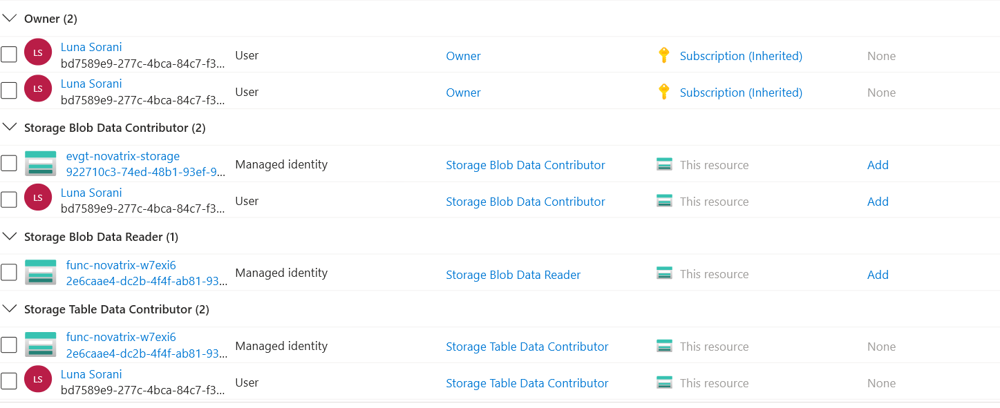

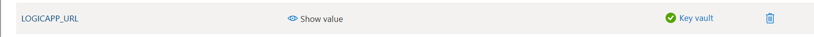

## Hur dubbletter stoppas

Event Grid kan ibland leverera samma händelse två gånger. Utan skydd skulle kunden då få två mejl. Så här gör funktionen:

1. Skapar en rad i tabellen med ärende-id:t och `Notifierad = false`.
2. Finns raden redan och är markerad som notifierad avslutar funktionen utan att göra något mer.
3. Annars anropas Logic Appen. Går det fel försöker Event Grid igen senare.
4. När mejl och notis har skickats sätts `Notifierad = true`.

## Filerna

- `main.bicep` – alla resurser, roller, Logic Appens flöde och Event Grid-kopplingen
- `main.bicepparam` – Teams-id:n. Mejladressen läses från en miljövariabel så att den inte hamnar i repot.
- `function/function_app.py` – själva funktionen
- `function/host.json` och `function/requirements.txt` – inställningar och Python-paket

## Så driftsatte jag

Mallen körs två gånger. Event Grid-kopplingen kan bara skapas när funktionen redan finns, så första gången skapas allt annat, sedan laddas koden upp och till sist skapas kopplingen.

```bash
az group create -n rg-novatrix -l swedencentral --tags projekt=novatrix uppgift=6B

export NOTIS_MEJL=<mejladress>
export UTVECKLARE_OBJECT_ID=$(az ad signed-in-user show --query id -o tsv)

# 1. Allt utom Event Grid-kopplingen
export SKAPA_PRENUMERATION=false
az deployment group create -g rg-novatrix -n modul1-steg1 --parameters main.bicepparam

# 2. Ladda upp funktionskoden
az functionapp deployment source config-zip -g rg-novatrix -n func-novatrix-w7exi6 \
  --src function.zip --build-remote true

# 3. Skapa Event Grid-kopplingen
export SKAPA_PRENUMERATION=true
az deployment group create -g rg-novatrix -n modul1-steg2c --parameters main.bicepparam
```

Zip-filen skapade jag i PowerShell med `Compress-Archive -Path function\* -DestinationPath function.zip`. Koden byggs i Azure (`--build-remote`), så jag behövde inte ha Python installerat på datorn.

Ett steg går inte att göra med kod. Kopplingarna till Outlook och Teams måste godkännas en gång i portalen (API connection → Edit API connection → Authorize). Första gången loggade jag in med mitt privata Microsoft-konto, och då fick både mejlet och Teams-inlägget felet `401 Unauthorized`. Det krävs ett M365-konto, så jag loggade in igen med `azureuser@96lonsorgmail.onmicrosoft.com`.

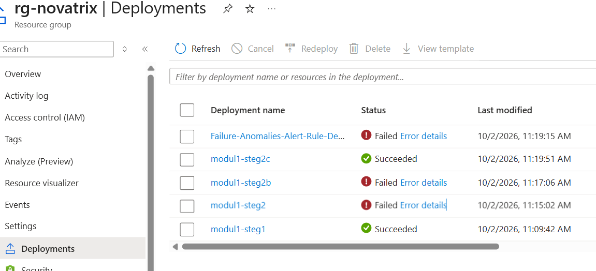

`modul1-steg2` och `steg2b` misslyckades på grund av rollen för dead-letter. `Failure-Anomalies-Alert-Rule-Deployment` startade Application Insights själv för att skapa ett automatiskt larm. Den misslyckades eftersom en resursleverantör (`Microsoft.AlertsManagement`) inte var registrerad. Det påverkade inte kedjan, och jag har registrerat leverantören inför modul 3.

## Test och resultat

Jag testade genom att ladda upp ärenden direkt till containern, i samma format som webbappen använder:

```bash
az storage blob upload --account-name stnovatrixw7exi6thpfmeq -c arenden \
  -n arende-test6b02.json -f arende-test6b02.json --auth-mode login --overwrite
```

### Test 1: ärende `test6b01`

Det här ärendet laddade jag upp medan Outlook och Teams fortfarande var godkända med fel konto. Funktionen skrev raden i tabellen, men Logic Appen fick fel. Event Grid försökte då igen fyra gånger. När jag hade loggat in med rätt konto gick nästa försök igenom av sig självt. Jag behövde inte göra något mer, och det visar att omförsöken fungerar.

### Test 2: ärende `test6b02`

Gick igenom direkt. Det tog ungefär 13 sekunder från uppladdning till att mejl och Teams-inlägg var skickade.

### Test 3: samma ärende igen

Jag laddade upp `test6b02` en gång till. Funktionen startade, såg att ärendet redan var hanterat och avslutade direkt. Ingen ny Logic App-körning och inget nytt mejl. Totalt kom två mejl och två Teams-inlägg, ett per ärende.

### Bilder

Event Grid levererade 3 händelser. 4 leveranser misslyckades, alla för test6b01 innan inloggningen var rättad.

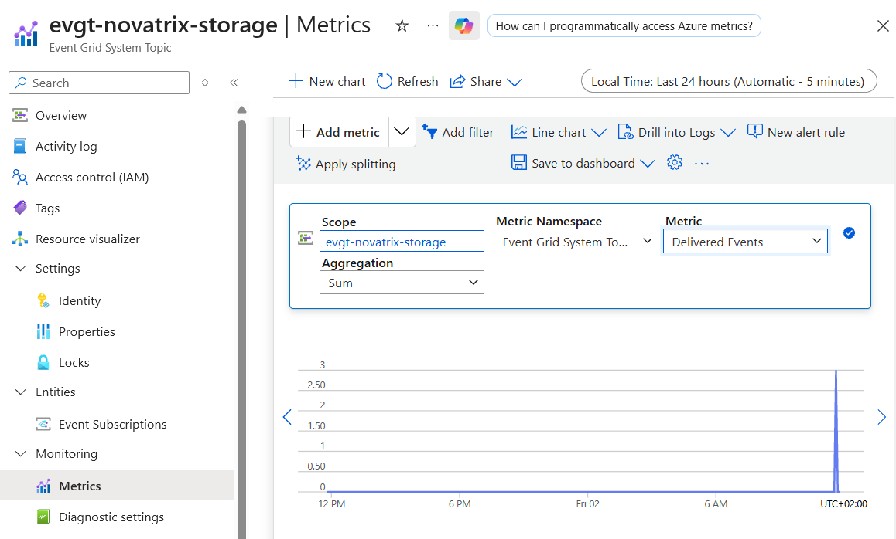
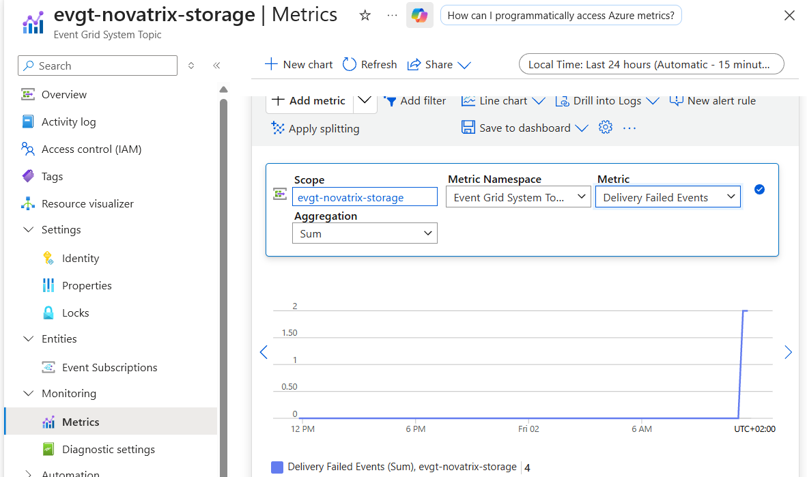

Filtret som bara släpper igenom `.json` i `arenden`:

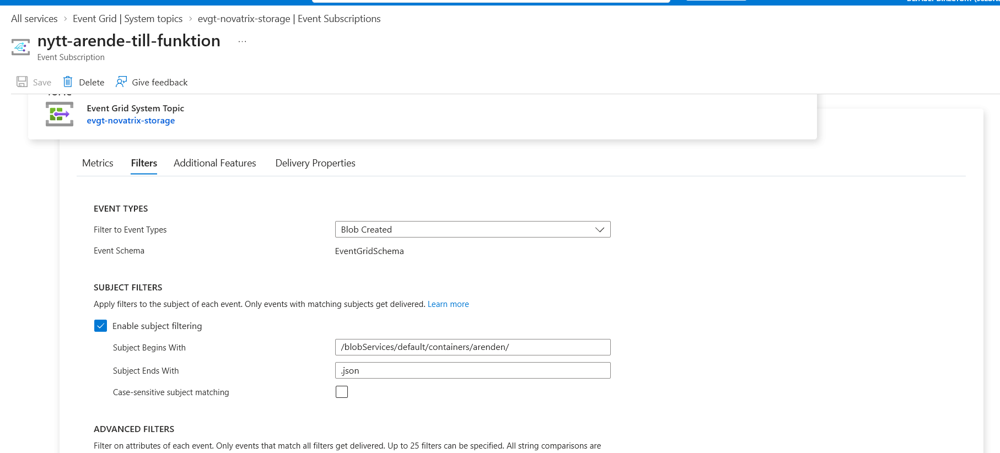

Funktionens körningar, först fyra fel och sedan tre lyckade:

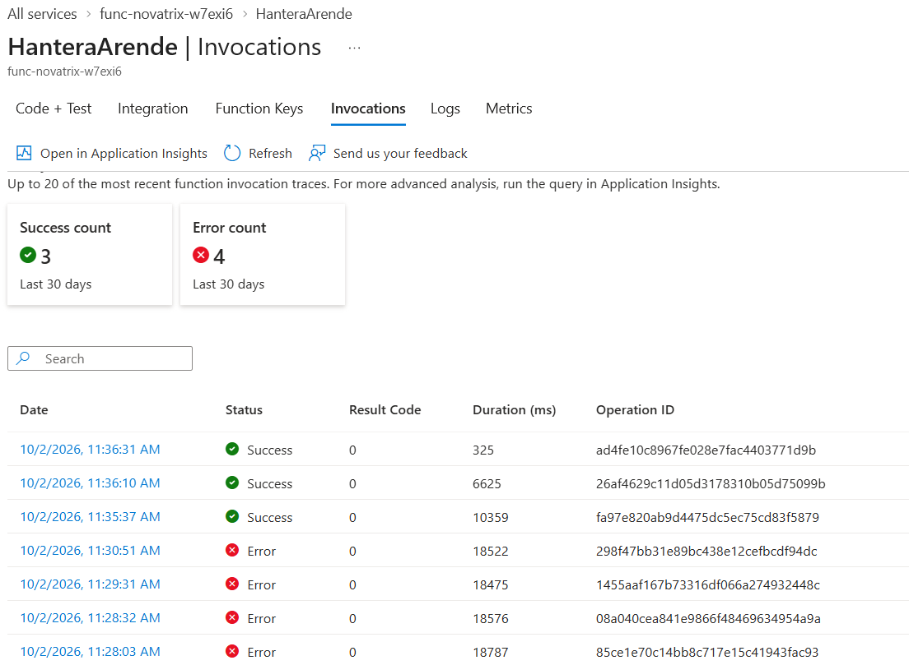

Logic Appens körningar, fyra misslyckade och två lyckade. Dubbletten kom aldrig hit:

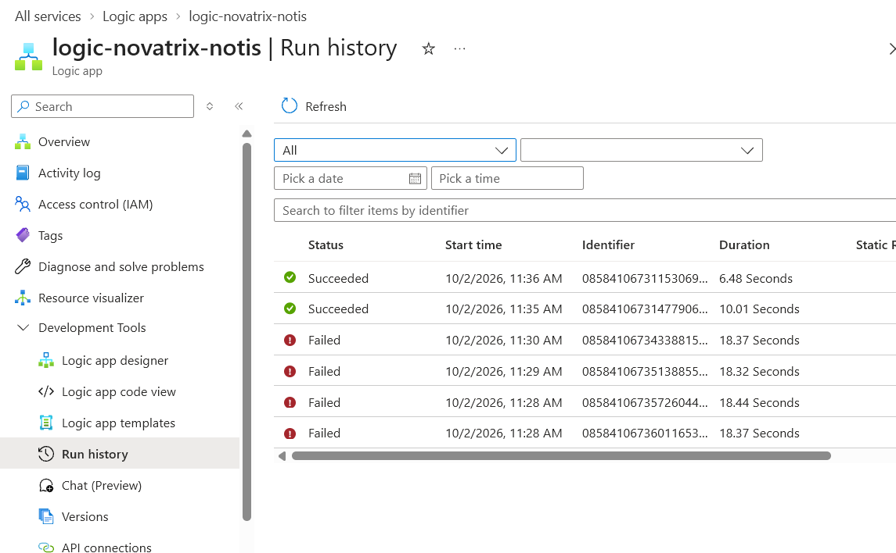

Raderna i ärenderegistret:

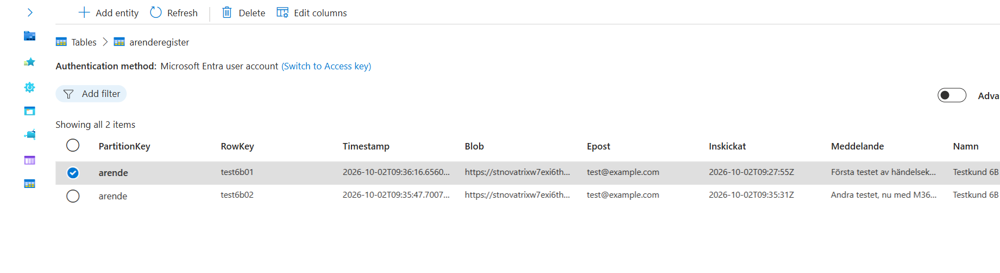

Loggraden som visar att dubbletten stoppades. Frågan jag använde:

```
AppTraces
| where TimeGenerated > ago(1d)
| where Message has "test6b0" or Message has "redan hanterat"
| project TimeGenerated, Message
| order by TimeGenerated asc
```

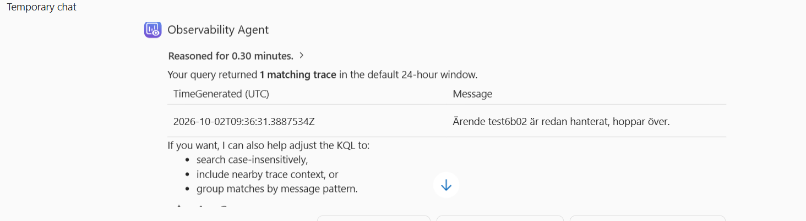

Mejlen och Teams-inläggen:

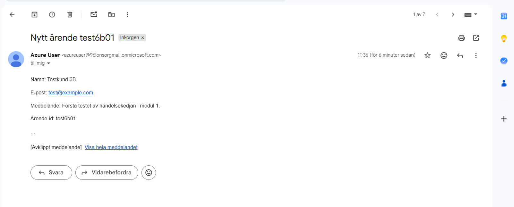
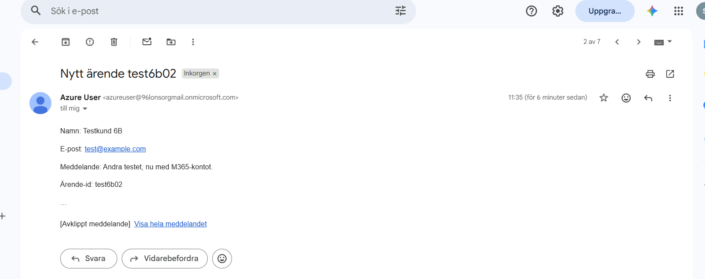
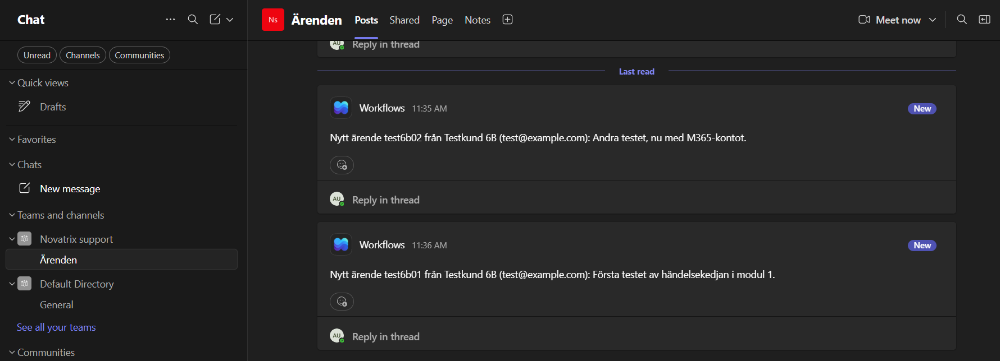

## Kostnad och städning

När inga ärenden kommer in kostar kedjan nästan ingenting. Funktionen, Logic Appen, Event Grid och tabellen betalas per användning. Log Analytics och Key Vault kostar lite, men med några testärenden handlar det om ören. Innan jag började satte jag ett budgetlarm på 100 kr i månaden (se modul 3).

Allt tas bort med:

```bash
az group delete -n rg-novatrix
```

Key Vault ligger kvar som borttaget i 7 dagar. Om resursgruppen ska skapas igen innan dess måste valvet tas bort helt först med `az keyvault purge -n <valvnamn>`, annars blir det namnkrock.
