# Nordvik Fastigheter – hyresgästportal med felanmälan

Repo: https://github.com/96lonsor/azure-MOV25 (mappen `Nordvik/`)

Nordvik förvaltar 48 fastigheter och ungefär 3 200 lägenheter och lokaler. De ville ha en portal i Azure där hyresgästerna loggar in och gör en felanmälan med rubrik, beskrivning och en bild. Förvaltarna tar hand om anmälningarna och ekonomi ska kunna titta men inte ändra något. Varje anmälan ska också hamna i en lista i Microsoft 365 och ge en notis till förvaltaren, och vid akuta fel ska det komma ett mejl direkt.

Under kursen har jag byggt ett kundtjänstformulär åt Novatrix. Där fanns bara en roll, några ärenden i timmen och en VM som stod på dygnet runt. Nordvik är ganska annorlunda. Här finns tre roller, personuppgifter om hyresgäster, trafik som går upp och ner väldigt mycket och ett krav på att portalen ska klara att en instans går ner. Så jag började om från Nordviks siffror i stället för att kopiera det jag gjort för Novatrix.

## Filerna

- `infra/azuredeploy.json` – ARM-mallen för allt i Azure
- `infra/azuredeploy.parameters.prod.json` och `azuredeploy.parameters.test.json` – en parameterfil per miljö
- `scripts/entra.sh` – grupper, appregistrering och testanvändare i Entra ID
- `scripts/deploy.sh` – bygger miljön från repot
- `app/` – portalen (Flask) och Dockerfile
- `power-automate/` – JSON-schemat för flödets HTTP-trigger
- `bilder/` – skiss och skärmdumpar

## Del A – Tjänster och virtualiseringsnivåer

### De centrala tjänsterna

Compute är det som kör koden. En virtuell maskin är en hel dator med operativsystem som man själv ansvarar för, och vill man ha flera likadana kan man använda ett VM Scale Set. Azure Container Instances (ACI), som jag använde i V40, kör en container men skalar inte. Azure Container Apps kör också containrar men har lastbalansering, HTTPS och autoskalning inbyggt, och kan skala ner till noll. Azure Functions är serverless, där man bara laddar upp kod som körs när något händer. Imagen till en container lagras i Azure Container Registry (ACR).

I nätverket är grunden ett VNet som delas upp i subnät. En NSG filtrerar trafiken in och ut från ett subnät med regler för källa, mål och port. En private endpoint ger till exempel ett storage account en privat IP-adress inne i VNet:et, och med en privat DNS-zon pekar kontots vanliga namn då på den adressen i stället för på den publika.

Ett storage account kan innehålla Blob Storage för filer, Table Storage för enkla rader, köer och filresurser. Blobbar kan ligga i olika nivåer, Hot, Cool, Cold och Archive, som blir billigare att lagra men dyrare att läsa ju kallare de är. Lifecycle-regler flyttar dem automatiskt. Redundansen väljs för hela kontot. LRS har tre kopior i samma datacenter, och ZRS sprider kopiorna över tre zoner.

Runt det här finns Entra ID för användare och grupper, RBAC för vem som får göra vad, managed identity så att en tjänst kan logga in utan lösenord, och Azure Policy, Cost Management och Log Analytics för att hålla ordning och följa upp.

### VM, containers och serverless

Skillnaden är egentligen hur mycket man sköter själv och vad man betalar för.

En VM virtualiserar hårdvaran. Hypervisorn delar upp en fysisk server i flera virtuella datorer som har varsitt operativsystem. Man får göra vad man vill, men man får också patcha OS:et, installera webbserver, hålla koll på SSH och se till att maskinen är igång. Man betalar per timme så länge den är på, även om ingen använder den. Ska den klara att en maskin går ner behövs minst två VM:ar och en lastbalanserare.

En container virtualiserar operativsystemet i stället. Containrarna delar värdens kärna, och imagen innehåller bara appen och det den behöver. Den startar på några sekunder och beter sig likadant var den än körs. I Container Apps sköter Azure maskinerna under, så jag behöver bara bry mig om imagen. Man betalar per sekund för CPU och minne, och en replika som inte gör något kostar bara ett lägre vilopris.

Med serverless skriver man bara en funktion och väljer vad som ska starta den. Azure startar och stänger instanser själv och man betalar per körning. Det passar bra för korta saker som händer ibland, men mindre bra för en webbsida med inloggning och filuppladdning, och första anropet efter en stund kan få vänta på en kallstart.

### Varför jag valde containers

Jag valde Container Apps, och det var trafiken som avgjorde.

Oftast är det 5–10 personer inne samtidigt, men vid månadsskiftet och när något går sönder kan det bli 120, och en vattenläcka kan ge 300 anmälningar på en timme. Mellan 00 och 06 är det nästan tomt. Med VM:ar hade jag fått dimensionera för toppen och betala för det hela tiden. Två VM:ar plus lastbalanserare skulle hamna nära hela budgeten på 2 500 kr i månaden. Ett scale set kan skala, men det tar några minuter att starta nya VM:ar, och en läcka ger en topp direkt. Nordvik hade också fått patcha servrar som hanterar personuppgifter. Dessutom har jag haft kvotproblem med VM-storlekar i swedencentral under hela kursen.

Med Container Apps kunde jag i stället ställa in skalningen efter dygnet. Mellan 06 och 22 körs två replikor i olika zoner, så om den ena går ner tar den andra över, och det täcker kravet på 99,5 procent på kontorstid. På natten körs en replika. Jag funderade på att låta den gå ner till noll, men en akut anmälan klockan tre på natten ska inte behöva vänta på att något startar, och en replika i vila kostar bara några kronor i månaden. Vid toppar skalar den upp till tio replikor på några sekunder. Och samma mall och image kan bli en testmiljö som står på noll när ingen använder den.

Serverless passade inte för själva portalen, av samma skäl som ovan. Men kopplingen till Microsoft 365 är ändå serverless, eftersom Power Automate-flödet bara körs när det kommer in en anmälan.

## Planering

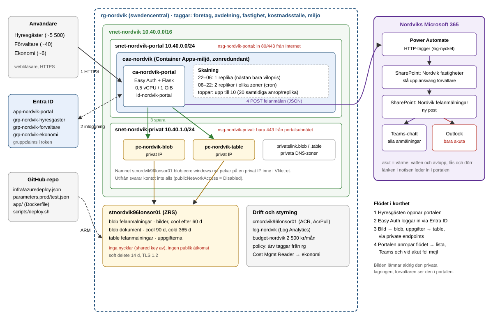

Jag började med att gå igenom underlaget och skriva upp vad varje siffra betydde för lösningen.

Den ojämna trafiken och kravet på att inte betala för tom kapacitet på natten ledde till Container Apps med en cron-regel för dagtid och en HTTP-regel för toppar. Att portalen ska tåla att en instans faller bort löste jag med två replikor i olika zoner, och lagringen fick ZRS så att även data klarar att en zon försvinner.

Personuppgifterna gjorde att lagringen fick stängd publik åtkomst, nås bara via private endpoints och inte har några nycklar alls. Rollerna löste jag med tre grupper i Entra ID som portalen läser av vid inloggning.

Bilderna blir 5–10 GB om året, och kontrakten är 40 GB som nästan aldrig läses efter tre månader. Därför har lagringen regler som flyttar dokumenten till Cool efter 90 dagar och Cold efter ett år.

Notisen ska gå till den förvaltare som är ansvarig, så flödet slår upp förvaltaren per fastighet i en SharePoint-lista. Teams-notis kommer alltid, och mejl bara för värme, vatten och lås.

Ekonomi vill följa kostnaden per fastighet och avdelning, så allt är taggat, en policy ser till att resurser som Azure skapar själv också får taggar, och ekonomigruppen får läsa kostnaderna i Azure. Att snabbt kunna sätta upp en testmiljö löste jag med en mall och två parameterfiler. Jag räknade med att det skulle hamna runt 800 kr i månaden, alltså under riktvärdet, och lade en budget med larm på 2 500 kr.

### Avgränsningar

Appen är enkel med flit. Den har ingen sökning, ingen historik över vem som ändrat vad och ingen kvittens till hyresgästen, eftersom tyngdpunkten skulle ligga på infrastrukturen.

Hyresgästerna är vanliga användare i min tenant (Bubblan och Buttran). Med 5 500 riktiga hyresgäster borde man använda Entra External ID, där kunderna skapar egna konton, men portalen skulle fungera på samma sätt.

Min tenant har Entra ID Free, och då går det inte att koppla app-roller till grupper (det kräver P1). Jag använde gruppclaims i stället. Token innehåller id:n för användarens grupper och portalen jämför dem med Nordvik-grupperna, så behörigheten styrs ändå helt med gruppmedlemskap.

Alla förvaltare ser alla anmälningar. Det vore bättre om varje förvaltare bara såg sina egna fastigheter, men då skulle portalen behöva veta vem som har vilken fastighet. Nu finns den kopplingen bara i SharePoint.

Jag har ingen WAF. Application Gateway med WAF kostar ungefär lika mycket som hela budgeten, och Front Door Premium är också dyr. Skyddet utåt är i stället att ingressen bara tar HTTPS, att man måste logga in innan man kommer till appen och att appen själv kontrollerar det som laddas upp.

Registryt är Basic och går därför att nå publikt, eftersom private endpoints för ACR kräver Premium. Admin-kontot är avstängt, det finns inga hemligheter i imagen och det är bara portalens identitet som får hämta den.

Status ändras i portalen. SharePoint-listan är förvaltarnas register i Microsoft 365, men ändringar där går inte tillbaka till portalen.

## Del B – Praktisk lösning

Allt i Azure ligger i `rg-nordvik` i swedencentral.

### Delmoment 1 – Compute

Portalen är en liten Flask-app i `app/` som körs med gunicorn i en container. Dockerfilen utgår från `python:3.12-slim` och kör inte som root:

```dockerfile
FROM python:3.12-slim
WORKDIR /app
COPY requirements.txt .
RUN pip install --no-cache-dir -r requirements.txt
COPY app.py .
COPY templates templates
COPY static static
RUN useradd --uid 10001 --no-create-home portal
USER portal
CMD ["gunicorn", "--bind", "0.0.0.0:8000", "--workers", "2", "--threads", "4", "app:app"]
```

Imagen byggs i registryt med `az acr build`, så jag behövde inte Docker lokalt, precis som i V40. Taggen är commit-id:t, så att jag ser vilken version som kör.

Appen heter `ca-nordvik-portal` och kör i Container Apps-miljön `cae-nordvik`. Varje replika har 0,5 vCPU och 1 GiB minne, vilket räcker gott för ett formulär. Skalningen ser ut så här i mallen:

```json
"scale": {
  "minReplicas": "[parameters('minReplikor')]",
  "maxReplicas": "[parameters('maxReplikor')]",
  "rules": [
    {
      "name": "kontorstid",
      "custom": {
        "type": "cron",
        "metadata": {
          "timezone": "Europe/Stockholm",
          "start": "0 6 * * *",
          "end": "0 22 * * *",
          "desiredReplicas": "[string(parameters('dagReplikor'))]"
        }
      }
    },
    { "name": "http-topp", "http": { "metadata": { "concurrentRequests": "20" } } }
  ]
}
```

I prod är det minst 1 replika, 2 på dagen och högst 10. HTTP-regeln lägger till en replika per 20 samtidiga anrop, så 120 användare vid månadsskiftet blir ungefär sex replikor, och resten finns kvar som marginal.

Formuläret har rubrik, beskrivning och bild. Jag lade också till fastighet, lägenhetsnummer, kategori och en ruta för om förvaltaren får gå in med huvudnyckel, eftersom en förvaltare behöver veta det. Kategorin bestämmer om felet räknas som akut. Kategorierna är klickbara rutor i stället för en rullista, och de akuta är märkta så att hyresgästen ser det direkt.

Utseendet gjorde jag enkelt: hela sidan i en babyrosa färg med vit text, menyn till vänster och innehållet till höger.

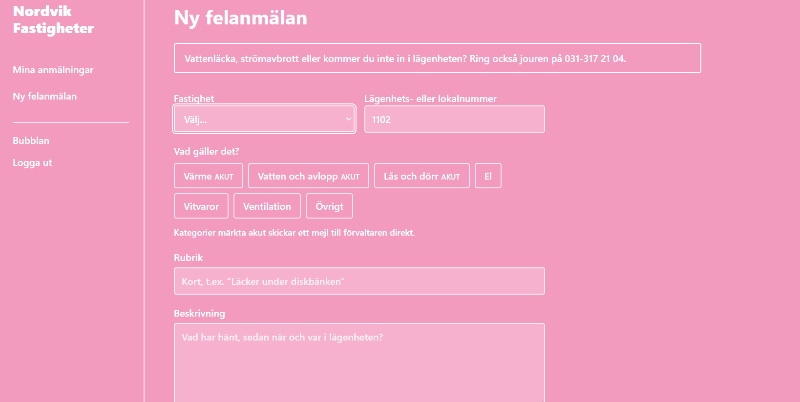
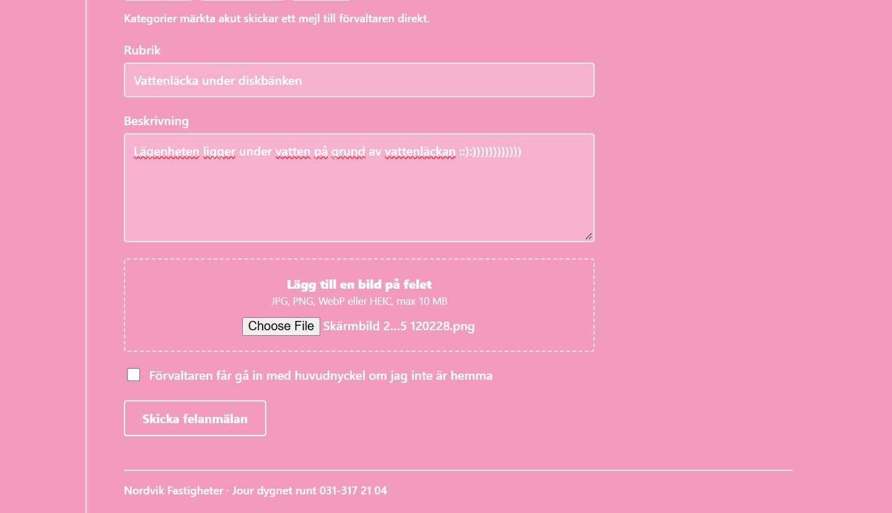

Appen svarar på `/health` utan inloggning, och den adressen använder Container Apps för att kolla att containern lever. Efter utrullningen:

```
$ curl https://ca-nordvik-portal.salmonpebble-8cef80a1.swedencentral.azurecontainerapps.io/health
{"flow_configured":true,"miljo":"prod","status":"ok","storage":"stnordvik96lonsor01"}

$ az containerapp replica list -g rg-nordvik -n ca-nordvik-portal -o table
Name                                         RunningState
-------------------------------------------  --------------
ca-nordvik-portal--0000001-6bd85956c4-9plvj  Running
ca-nordvik-portal--0000001-6bd85956c4-pg94z  Running
```

Klockan var 13 och två replikor körde, så cron-regeln fungerade. Samma kommando tidigt på morgonen, före 06, visade en replika.

### Delmoment 2 – IAM

Jag delade upp det i två delar. Den ena är vem som får göra vad i portalen, och den andra är vad portalen och personalen får göra i Azure.

Till portalen skapade jag tre grupper med `scripts/entra.sh`: `grp-nordvik-hyresgaster`, `grp-nordvik-forvaltare` och `grp-nordvik-ekonomi`. Appregistreringen `app-nordvik-portal` är inställd så att token innehåller gruppernas id:n. Inloggningen sköts av den inbyggda autentiseringen i Container Apps (Easy Auth). Den släpper inte in någon som inte är inloggad och skickar sedan med vem användaren är till appen. Appen kollar rollen på varje sida:

```python
@app.get("/forvaltare")
@kraver("forvaltare")
def forvaltare():
    ...
```

Hyresgästens anmälningar sparas med hyresgästens id som PartitionKey i tabellen, och listan hämtar bara den egna partitionen:

```python
rader = tabell().query_entities("PartitionKey eq @oid", parameters={"oid": g.anv["oid"]})
```

Appen hämtar alltså aldrig andras anmälningar och filtrerar bort dem efteråt, den frågar bara efter de egna. Ekonomi får bara antal per fastighet, kategori, status och månad, och frågan hämtar bara de kolumnerna, så namn, beskrivningar och bilder kommer aldrig med.

Jag testade med fyra användare i var sitt inkognitofönster: Blomman är förvaltare, Bubblan och Buttran är hyresgäster och Professorn är ekonomi. Det behövs två hyresgäster för att kunna visa att de inte ser varandras anmälningar.

Bubblan gjorde en akut anmälan om en vattenläcka under diskbänken, med bild, och den syntes i hennes lista.

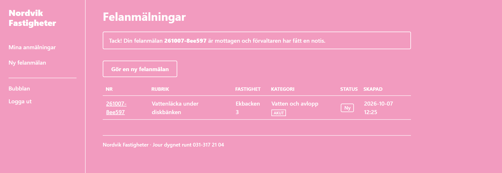

Buttran hade en tom lista, och när jag klistrade in länken till Bubblans anmälan stod det "Hittades inte".

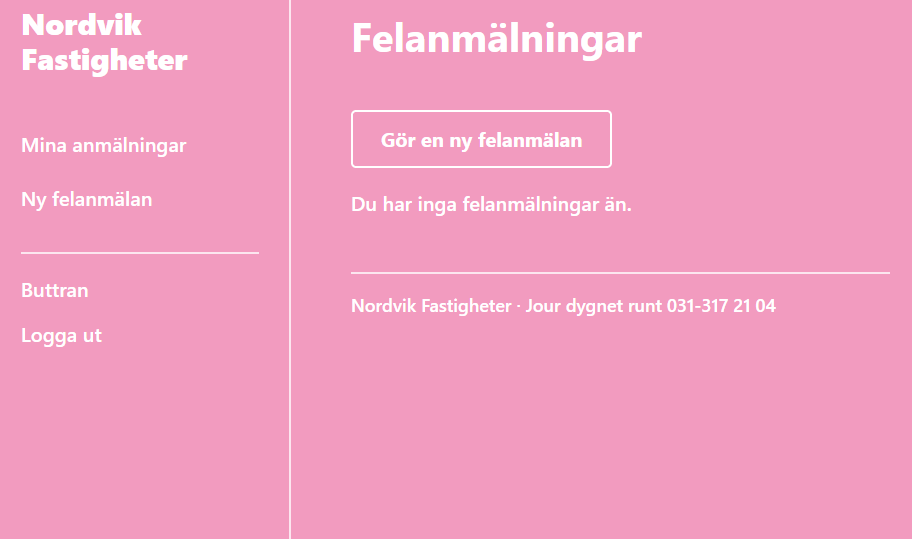
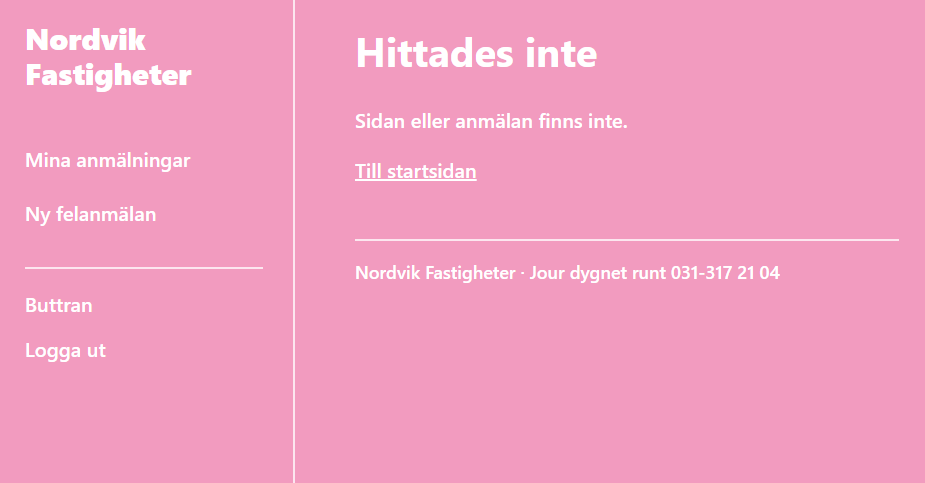

Blomman som förvaltare såg alla anmälningar, kunde öppna Bubblans med bilden och ändrade status till Pågår.

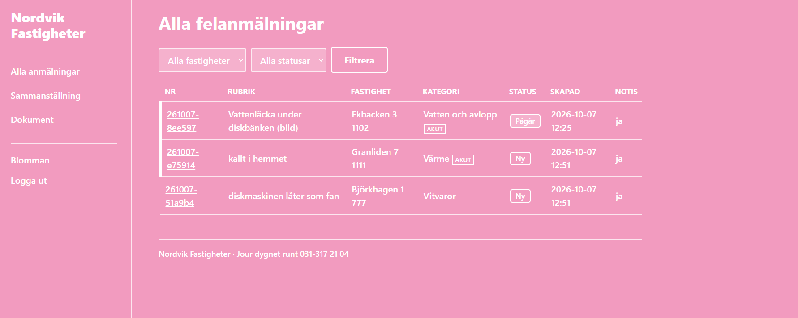
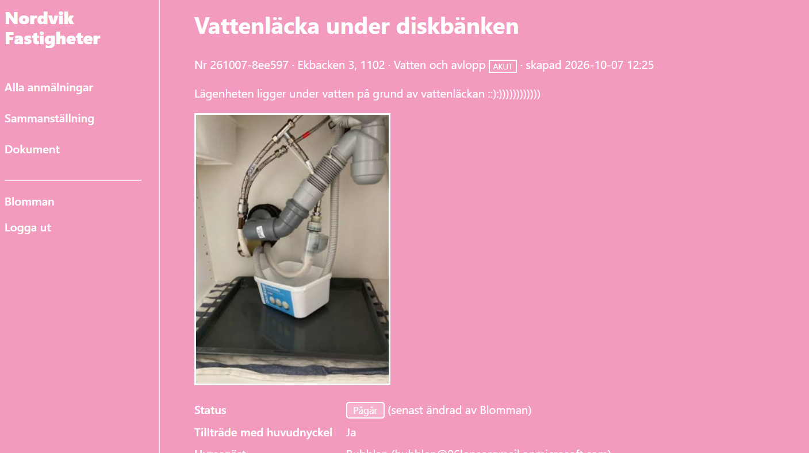

Professorn på ekonomi såg bara antal, och när Professorn gick till förvaltarsidan stod det "Ingen behörighet".

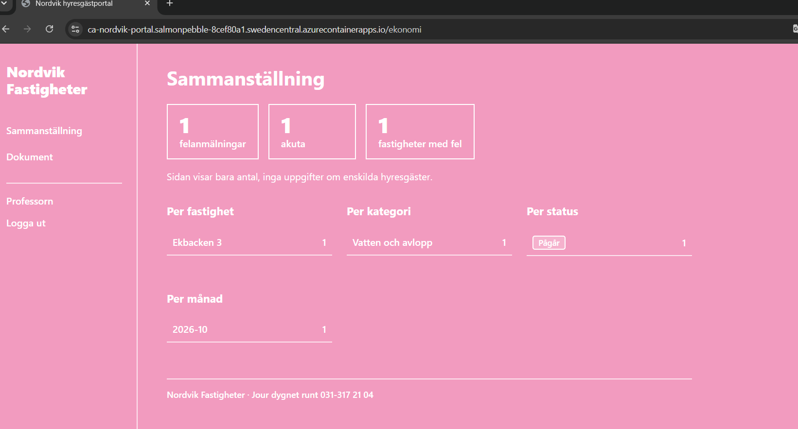
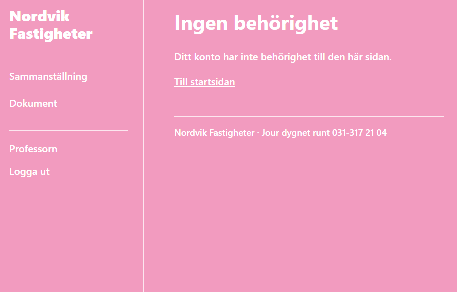

I Azure har portalen en hanterad identitet, `id-nordvik-portal`. Jag tog en användartilldelad i stället för en systemtilldelad, eftersom den finns innan appen skapas. Då hinner rollerna komma på plats innan appen startar första gången, och samma identitet kan hämta imagen från registryt. Den har fyra roller, och ingen av dem gäller hela storage-kontot:

```
AcrPull                         -> crnordvik96lonsor01
Storage Blob Data Contributor   -> containern felanmalningar
Storage Blob Data Contributor   -> containern dokument
Storage Table Data Contributor  -> tabellen felanmalningar
```

I mallen styrs det med `scope`, till exempel för tabellen:

```json
{
  "type": "Microsoft.Authorization/roleAssignments",
  "scope": "[format('Microsoft.Storage/storageAccounts/{0}/tableServices/default/tables/{1}', variables('stNamn'), variables('tabellNamn'))]",
  "properties": {
    "roleDefinitionId": "[subscriptionResourceId('Microsoft.Authorization/roleDefinitions', variables('roll').tableDataContributor)]",
    "principalId": "[reference(resourceId('Microsoft.ManagedIdentity/userAssignedIdentities', variables('idNamn')), '2023-01-31').principalId]",
    "principalType": "ServicePrincipal"
  }
}
```

Ekonomigruppen har Cost Management Reader på resursgruppen, så att de kan följa kostnaden men inte ändra något. Förvaltarna har ingen roll i Azure, eftersom de jobbar i portalen och i Microsoft 365, och hyresgästerna har förstås inget alls där.

### Delmoment 3 – Nätverk och säkerhet

Jag ville att det skulle krävas att flera saker går fel samtidigt innan någon kommer åt en anmälan. Så här många lager passerar man från internet till lagringen:

1. Det går bara att använda HTTPS. Port 80 skickas vidare till 443, och certifikatet ingår i Container Apps.
2. `nsg-nordvik-portal` släpper bara in 80 och 443 till portalens subnät.
3. Man måste logga in med Entra innan man kommer fram till appen.
4. Appen kollar roll, partition, filtyp på bilden och var formuläret skickas ifrån, och sätter säkerhetsheaders.
5. `nsg-nordvik-privat` släpper bara in 443 från portalens subnät till de privata ändpunkterna.
6. Lagringen har ingen publik åtkomst och inga nycklar, bara Entra-roller.

`vnet-nordvik` (10.40.0.0/16) har två subnät. `snet-nordvik-portal` (10.40.0.0/24) är delegerat till Container Apps. I `snet-nordvik-privat` (10.40.1.0/24) ligger `pe-nordvik-blob` och `pe-nordvik-table`, som ger storage-kontot privata adresser. De privata DNS-zonerna är länkade till VNet:et, så inifrån pekar storage-namnet på en privat adress:

```
$ az network private-dns record-set a list -g rg-nordvik -z privatelink.blob.core.windows.net ...
stnordvik96lonsor01    10.40.1.5
$ az network private-dns record-set a list -g rg-nordvik -z privatelink.table.core.windows.net ...
stnordvik96lonsor01    10.40.1.4
```

En sak jag fick lära mig var att standardregeln `AllowVnetInBound` släpper in trafik från hela VNet:et. Därför har NSG:n för det privata subnätet en egen deny-regel efter den regel som släpper in portalen:

```json
{
  "name": "Tillat-Portal-Till-Lagring",
  "properties": {
    "priority": 100, "direction": "Inbound", "access": "Allow", "protocol": "Tcp",
    "sourceAddressPrefix": "[variables('snetPortalPrefix')]",
    "destinationAddressPrefix": "[variables('snetPrivatPrefix')]",
    "destinationPortRange": "443"
  }
},
{
  "name": "Neka-Allt-Annat-Inkommande",
  "properties": {
    "priority": 4000, "direction": "Inbound", "access": "Deny", "protocol": "*",
    "sourceAddressPrefix": "*", "destinationAddressPrefix": "*", "destinationPortRange": "*"
  }
}
```

För att NSG:n ska gälla för private endpoints måste `privateEndpointNetworkPolicies` vara `Enabled` på subnätet, annars bryr sig Azure inte om den.

Sedan provade jag att komma åt lagringen från min egen dator, inloggad som ägare till prenumerationen:

```
$ az storage blob list --account-name stnordvik96lonsor01 -c felanmalningar --auth-mode login
The request may be blocked by network rules of storage account.

$ curl -s -o /dev/null -w "%{http_code}" "https://stnordvik96lonsor01.blob.core.windows.net/felanmalningar?restype=container"
403

$ curl -s -o /dev/null -w "%{http_code} -> %{redirect_url}" http://ca-nordvik-portal.salmonpebble-8cef80a1.swedencentral.azurecontainerapps.io/
301 -> https://ca-nordvik-portal.salmonpebble-8cef80a1.swedencentral.azurecontainerapps.io/
```

Jag kom inte åt lagringen fast jag är ägare, men portalen kunde spara Bubblans anmälan med bild. Vägen in går alltså bara genom VNet:et.

### Delmoment 4 – Storage

Storage-kontot heter `stnordvik96lonsor01` och är StorageV2 med ZRS. Felanmälan är affärskritisk, och med så lite data kostar ZRS bara några kronor mer än LRS. De viktigaste inställningarna:

```json
"properties": {
  "publicNetworkAccess": "Disabled",
  "allowBlobPublicAccess": false,
  "allowSharedKeyAccess": false,
  "defaultToOAuthAuthentication": true,
  "minimumTlsVersion": "TLS1_2",
  "supportsHttpsTrafficOnly": true,
  "networkAcls": { "defaultAction": "Deny", "bypass": "None" }
}
```

Med `allowSharedKeyAccess: false` fungerar inte kontonycklarna alls, så en nyckel eller SAS-token som läcker kan inte användas. I V37 använde jag SAS-token, men här ville jag inte ha någon sådan väg in.

I portalen syns att kontot ligger i swedencentral med ZRS och har fått taggarna från mallen:

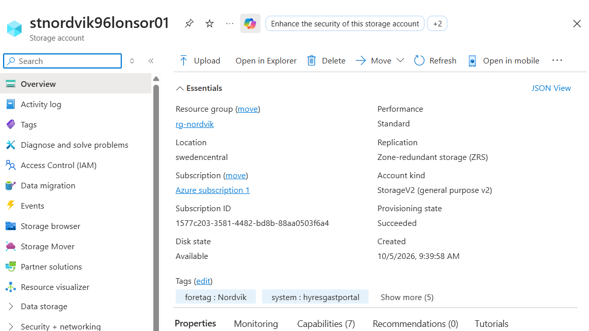

Kontot har containern `felanmalningar` för bilderna, med en mapp per anmälan, och containern `dokument` för kontrakt och besiktningsprotokoll, där förvaltare kan ladda upp PDF:er från portalen. Uppgifterna om varje anmälan ligger i tabellen `felanmalningar`. Jag valde Table Storage för att portalen ska kunna lista och filtrera, och en riktig databas hade varit för mycket för ungefär 25 000 rader om året.

När en hyresgäst skickar in sparas bilden först, sedan raden, och sist skickas notisen:

```python
bild_namn = f"{anmalan_id}/bild.{bild_ext}"
blob_service().get_blob_client(BILD_CONTAINER, bild_namn).upload_blob(bild_data, ...)
tabell().create_entity(post)
notifiera(post)
```

Innan bilden sparas läser appen de första byten i filen och godtar bara JPG, PNG, WebP och HEIC upp till 10 MB. Det räcker alltså inte att döpa om en fil till `.png`.

Två lifecycle-regler håller nere kostnaden. Dokumenten flyttas till Cool efter 90 dagar och till Cold efter ett år, eftersom de sällan läses efter tre månader men måste finnas kvar. Bilderna flyttas till Cool efter 60 dagar och raderas efter tre år, eftersom personuppgifter inte ska sparas längre än de behövs. Archive gick inte att använda, eftersom det inte finns för ZRS. Raderade blobbar går att få tillbaka i 14 dagar och containrar i 7.

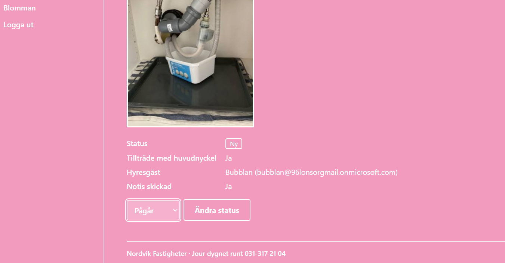

### Delmoment 5 – IaC

Allt i Azure finns i `infra/azuredeploy.json`. Prod och test använder samma mall och skiljer sig bara i parameterfilen. I testmiljön får alla namn `-test` sist, löpnumret blir 02 och VNet:et 10.41. Den skalar mellan 0 och 3 replikor, är inte zonredundant, har LRS i stället för ZRS och en budget på 500 kr. Kostnaden taggas på IT i stället för på förvaltningen.

Det finns inga hemligheter i repot. Klienthemligheten för inloggningen och flödets adress är `securestring`-parametrar som `deploy.sh` läser från `.env.local`, och den filen ligger i `.gitignore`. I Container Apps blir de secrets.

Grupper, appregistrering och användare i Entra ID kan inte skapas med ARM, så det gör `entra.sh` med Azure CLI. Det går att köra flera gånger utan att något skapas dubbelt.

Ett problem var att Container Apps måste peka på en image som redan finns, medan registryt skapas av samma mall. Därför kör `deploy.sh` mallen två gånger:

```bash
az deployment group create -g "$RG" --template-file infra/azuredeploy.json \
  --parameters "@$PARAMS" deployPortal=false
az acr build -r "$REGISTRY" -t "nordvik-portal:${TAGG}" app
az deployment group create -g "$RG" --template-file infra/azuredeploy.json \
  --parameters "@$PARAMS" deployPortal=true containerImage="$IMAGE" \
  entraClientSecret="${ENTRA_CLIENT_SECRET:-}" flowUrl="${FLOW_URL:-}"
```

Innan jag körde första gången gjorde jag en `what-if`, som visade 37 resurser att skapa och inga fel.

Första utrullningen gick inte så bra. Efter 23 minuter misslyckades Container Apps-miljön med `ManagedEnvironmentProvisioningError ... please retry later`, men allt annat hade skapats. För att se om felet låg hos mig skapade jag en enkel miljö utan VNet i en egen resursgrupp. Den lyckades, men tog 28 minuter. Jag tog bort den trasiga miljön, körde samma mall igen och då fungerade det. Efter det har jag kört skriptet flera gånger och mallen tar ungefär en minut, eftersom inget behöver skapas om. Den riktiga orsaken till felet förstod jag först när jag byggde testmiljön.

#### Testmiljön

Nordvik vill snabbt kunna sätta upp en likadan test- eller demomiljö, så jag provade:

```bash
./scripts/deploy.sh test
```

Efter en minut kom ett tydligare fel än det jag fått i prod:

```
ManagedEnvironmentCapacityHeavyUsageError: AKS is experiencing heavy usage in region swedencentral.
We are working on adding new capacity. In the meantime, please consider creating new AKS clusters
in a different region.
```

Swedencentral hade alltså ont om kapacitet för Container Apps. Det var antagligen samma sak som stoppade prod första gången. Regionen var redan en parameter i mallen, så jag lade till `"location": { "value": "northeurope" }` i testets parameterfil och ändrade `deploy.sh` så att den läser regionen därifrån. North Europe ligger i Irland, alltså inom EU. Prod ligger kvar i Sverige. Resurser kan inte flytta region, så den halvfärdiga testgruppen fick tas bort först.

Nästa försök stannade på att DNS-zonerna inte hittade `vnet-nordvik-test`. Ett VNet med samma namn hade raderats några minuter innan, så det var nog bara för tidigt. Jag körde kommandot igen och då gick det igenom på fem minuter, inklusive bygget av imagen.

```
$ curl https://ca-nordvik-portal-test.happyocean-ec720c4f.northeurope.azurecontainerapps.io/health
{"flow_configured":false,"miljo":"test","status":"ok","storage":"stnordvik96lonsor02"}

$ az containerapp show -g rg-nordvik-test -n ca-nordvik-portal-test --query "{region:location,min:...,max:...}"
{ "region": "North Europe", "min": 0, "max": 3 }

$ az storage account show -n stnordvik96lonsor02 --query "{sku:sku.name,public:publicNetworkAccess}"
Standard_LRS    Disabled
blob utifrån: 403
```

Att testmiljön inte har något flöde är med flit. `deploy.sh` skickar bara flödets adress till prod, så att testanmälningar inte hamnar i Nordviks riktiga lista och skickar notiser till förvaltarna. När jag hade kontrollerat allt rev jag testmiljön med `az group delete -n rg-nordvik-test` och tog bort dess adress från appregistreringen.

Efteråt fanns bara prod kvar, `rg-nordvik` och `rg-nordvik-cae`. `rg-novatrix` är från en tidigare uppgift.

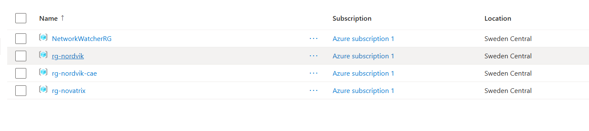

#### Taggar och budget

Alla resurser har taggarna `foretag`, `system`, `avdelning`, `kostnadsstalle`, `fastighet`, `agare` och `miljo`, och resursgruppen får samma taggar från mallen. Vissa resurser skapar Azure själv, till exempel nätverkskorten till private endpoints, och dem kan mallen inte tagga. Därför finns fem policytilldelningar (`pol-nordvik-tagg-foretag` och så vidare) med den inbyggda policyn "Inherit a tag from the resource group if missing". Nätverkskorten fick taggarna:

```
$ az resource list -g rg-nordvik --query "[].{n:name,avd:tags.avdelning,fast:tags.fastighet,ks:tags.kostnadsstalle}" -o table
N                     Avd          Fast      Ks
--------------------  -----------  --------  ------
...
nic-nordvik-pe-table  Forvaltning  Gemensam  KS4100
nic-nordvik-pe-blob   Forvaltning  Gemensam  KS4100
ca-nordvik-portal     Forvaltning  Gemensam  KS4100
```

Portalen används av alla 48 fastigheter, så `fastighet` är `Gemensam` på resurserna. Vill ekonomi fördela kostnaden per fastighet kan de göra det efter hur många anmälningar varje fastighet har, och det ser de på sammanställningssidan i portalen. Mallen skapar också budgeten `budget-nordvik` på 2 500 kr, som larmar vid 80 procent och när prognosen går över 100 procent.

#### Namngivning

Namnen följer mönstret typ-företag-syfte som vi har i klassen, till exempel `rg-nordvik`, `vnet-nordvik`, `snet-nordvik-portal`, `nsg-nordvik-privat`, `pe-nordvik-blob`, `log-nordvik`, `id-nordvik-portal`, `cae-nordvik`, `ca-nordvik-portal` och `budget-nordvik`. I testmiljön kommer `-test` sist. Storage-kontot heter `stnordvik96lonsor01`. Registryt har samma regler som storage, inga bindestreck och unikt i hela Azure, så det följer samma mönster: `crnordvik96lonsor01`. I Entra heter grupperna `grp-nordvik-…` och appen `app-nordvik-portal`. De privata DNS-zonerna måste heta `privatelink.blob.core.windows.net` och `privatelink.table.core.windows.net` för att det ska fungera, så där kunde jag inte följa mönstret. Policytilldelningarna hette först `arv-tagg-…`, men eftersom det inte följde mönstret döpte jag om dem till `pol-nordvik-tagg-…`.

### Delmoment 6 – Automation och integration

Flödet i Power Automate heter "Nordvik felanmälan till M365". När anmälan är sparad skickar portalen den till flödets HTTP-trigger. Schemat ligger i `power-automate/http-trigger-schema.json`, och ett anrop ser ut ungefär så här:

```json
{
  "anmalanId": "261007-e75914",
  "fastighet": "Granliden 7",
  "lagenhet": "1111",
  "kategori": "Värme",
  "akut": true,
  "rubrik": "kallt i hemmet",
  "beskrivning": "...",
  "harBild": false,
  "hyresgast": "Bubblan",
  "tilltrade": true,
  "skapad": "2026-10-07T10:51:..+00:00",
  "lank": "https://ca-nordvik-portal.../anmalan/261007-e75914"
}
```

Bilden skickas inte med. Den ligger kvar i den privata lagringen, och notisen har i stället en länk till anmälan i portalen. För Novatrix var ärendet bara text, men här skulle bilder och personuppgifter annars spridas till mejl och chattar.

Flödet ser ut så här:

1. When an HTTP request is received tar emot anmälan.
2. Get items slår upp fastigheten i SharePoint-listan "Nordvik fastigheter", där det står vilken förvaltare som ansvarar.
3. En Compose som jag döpte till Ansvarig plockar ut förvaltarens e-post, och om fastigheten saknas i listan används en reservadress:
   ```
   coalesce(first(body('Get_items')?['value'])?['ForvaltareEpost'], 'azureuser@96lonsorgmail.onmicrosoft.com')
   ```
4. Create item lägger in en rad i listan "Nordvik felanmalningar" med status Ny.
5. En Condition kollar om `akut` är true, och i så fall skickas ett mejl till förvaltaren med hög prioritet.
6. Post message in a chat or channel skickar alltid en Teams-notis till förvaltaren.

Hos Novatrix gick notisen till en gemensam kanal, men Nordvik har 40 förvaltare och 48 fastigheter, så notisen behöver gå till rätt person. Byter en förvaltare fastighet räcker det att ändra en rad i SharePoint. I labben pekar alla fastigheter på `azureuser`, eftersom det är det enda kontot som har Teams och Outlook.

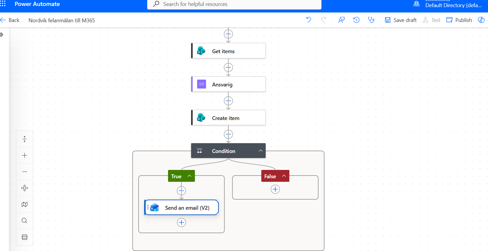
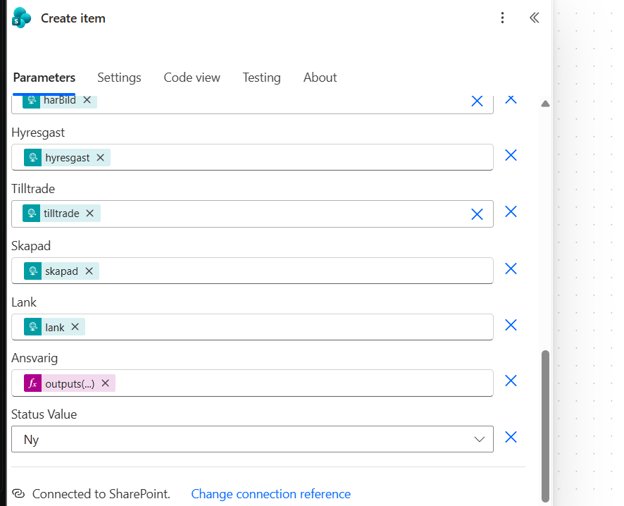

För att testa hela kedjan räknade jag med Bubblans vattenläcka och gjorde två anmälningar till som Bubblan. En var akut, "kallt i hemmet" (Värme) i Granliden 7, och en var vanlig om diskmaskinen (Vitvaror) i Björkhagen 1. Alltså två akuta och en vanlig. Alla tre fick "förvaltaren har fått en notis" i portalen, hamnade som rader i SharePoint-listan och gav ett meddelande i Teams. Men det kom bara två mejl, ett för varje akut anmälan, båda med hög prioritet. Flödet körde grönt alla tre gångerna.

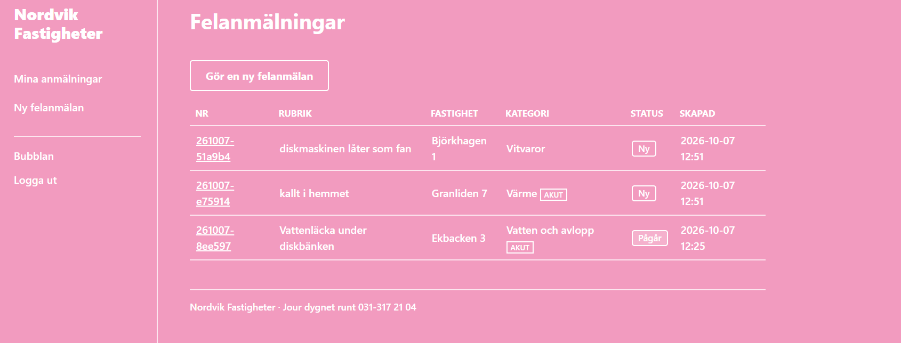
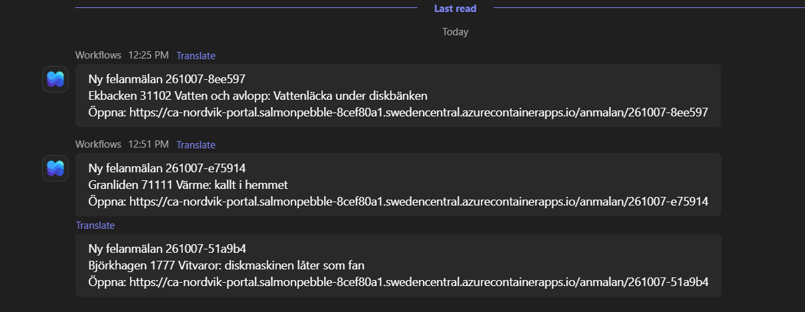
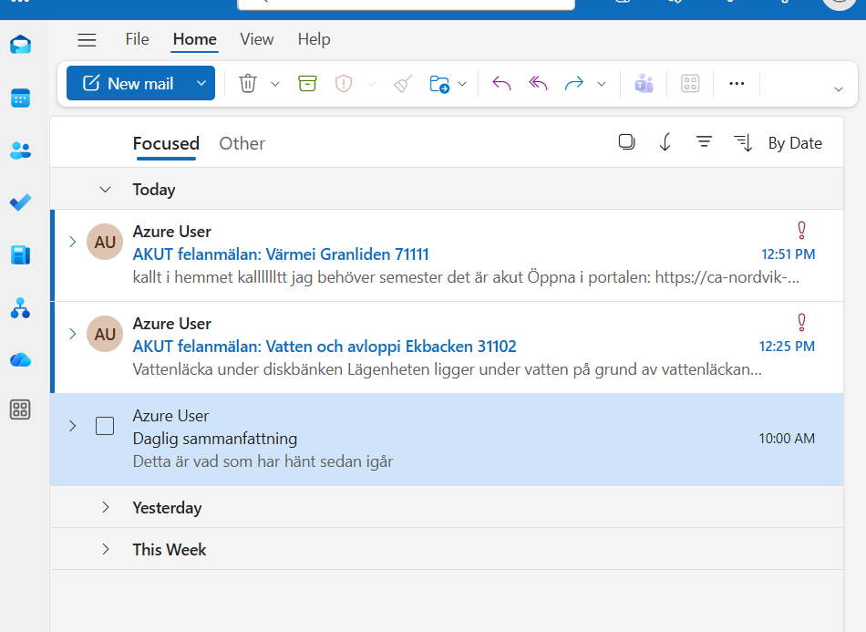
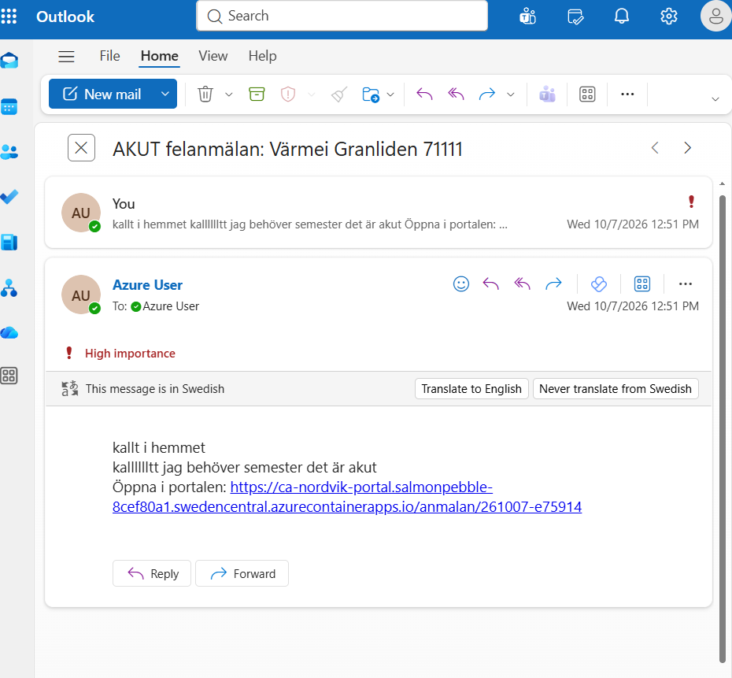
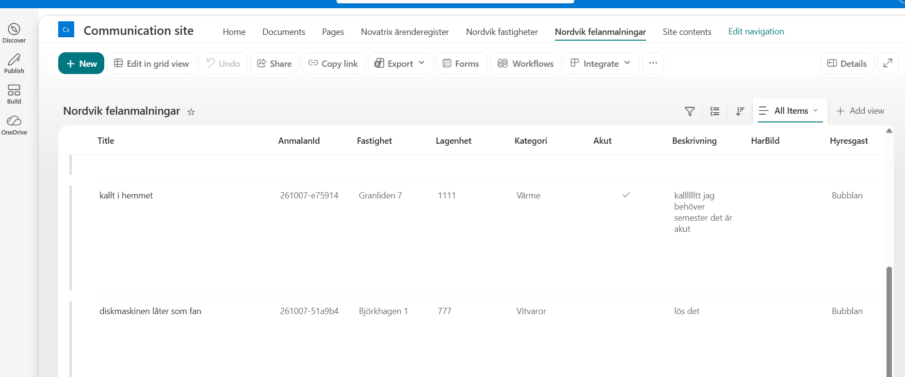
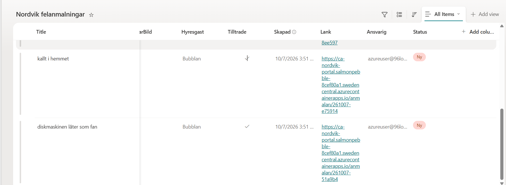
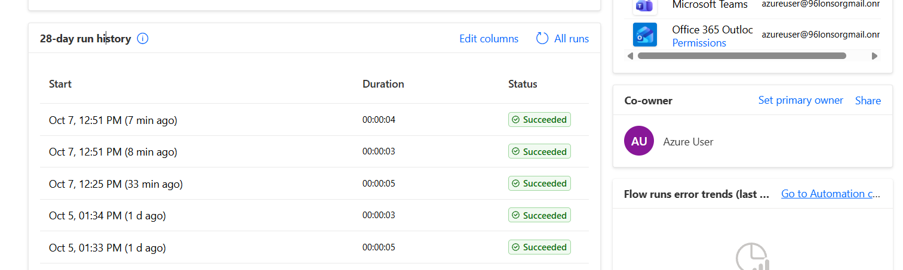

Körningen för diskmaskinen visar hur villkoret fungerar. Alla steg är gröna, men mejlsteget under True är gråmarkerat, alltså hoppades det över:

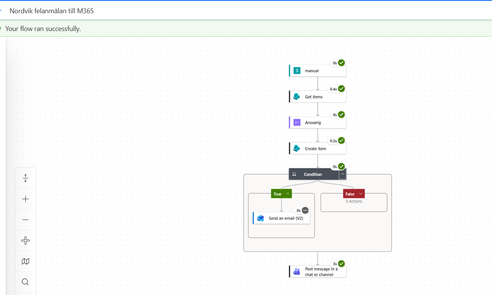

Om flödet inte svarar försvinner ingen anmälan, eftersom den redan är sparad. Portalen försöker tre gånger med lite väntan emellan. Lyckas det ändå inte står det "nej" i kolumnen Notis hos förvaltaren, och där finns en knapp för att skicka notisen igen. Efter testet stod det "ja" på alla tre i förvaltarens lista.

Det blev några småfel som jag lät vara. Teams-steget hamnade efter villkoret i stället för bredvid det. Det fungerar, men om mejlet skulle misslyckas kommer inte heller Teams-notisen, så nästa gång skulle jag ändra Run after på Teams-steget till Create item, som jag gjorde i V39. I ämnesraden och i Teams-meddelandet försvann mellanslagen runt fälten ("Värmei Granliden 71111"), och det skulle gå att lösa med `concat()`. SharePoint-siten visar tiden i amerikansk tidszon, och det ändras under Regional settings. Outlook-anslutningen heter "NovatrixArendeflode" eftersom den är samma som jag skapade i V39, med samma konto.

Flödets adress innehåller en nyckel (`sig=`), så den finns bara i `.env.local` och som secret i Container Apps.

### Delmoment 7 – Återskapa lösningen

Azure-delen byggs från repot så här:

```bash
git clone https://github.com/96lonsor/azure-MOV25.git
cd azure-MOV25/Nordvik
az login
./scripts/entra.sh
./scripts/deploy.sh prod      # eller test
```

`entra.sh` skriver ut id:n för grupperna och appen. De står redan i parameterfilerna, så de behöver bara ändras i en annan tenant. Flödet och SharePoint-listorna gör man som jag beskrev under delmoment 6, och flödets adress läggs in i `.env.local` som `FLOW_URL='...'` innan `deploy.sh` körs.

Riva allt:

```bash
az group delete -n rg-nordvik --yes
```

Resursgruppen `rg-nordvik-cae` som Container Apps skapar själv försvinner automatiskt när miljön tas bort.

## Kostnad

Det här är en uppskattning med ungefärliga listpriser och ungefär 10 kr per dollar. De exakta beloppen behöver kollas i Azure Pricing Calculator.

| Del | Ungefär per månad |
|---|---|
| Container Apps (2 replikor 16 h, 1 i vila 8 h) | 300–500 kr |
| 2 private endpoints | 150 kr |
| 2 privata DNS-zoner | 10 kr |
| Container Registry Basic | 50 kr |
| Storage ZRS, runt 50 GB mest i Cool | 30 kr |
| Log Analytics (tak på 1 GB per dag) | 0–30 kr |
| Publik IP för miljön | 40 kr |
| Totalt | 600–800 kr |

Det är ganska långt under 2 500 kr. Container Apps är räknat som om båda replikorna jobbar hela dagen, och i verkligheten står de mest i vila och blir billigare. Det som finns över räcker till att ha testmiljön uppe ibland och till att Nordvik växer med några fastigheter om året. Fler fastigheter ger mest fler anmälningar och lite mer lagring, inte fler servrar. På natten är det cron-regeln som håller nere kostnaden, och testmiljön kostar nästan ingenting när den står på noll replikor, och ingenting alls när den är riven.
