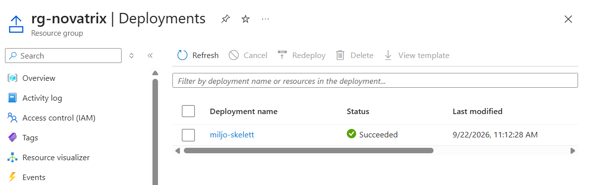
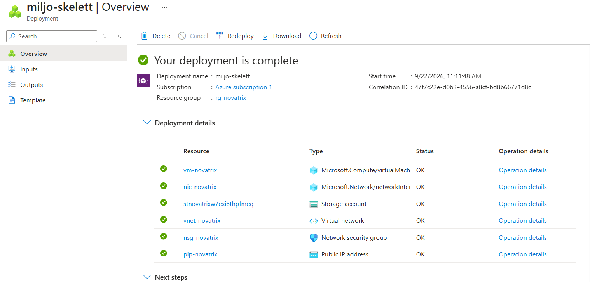
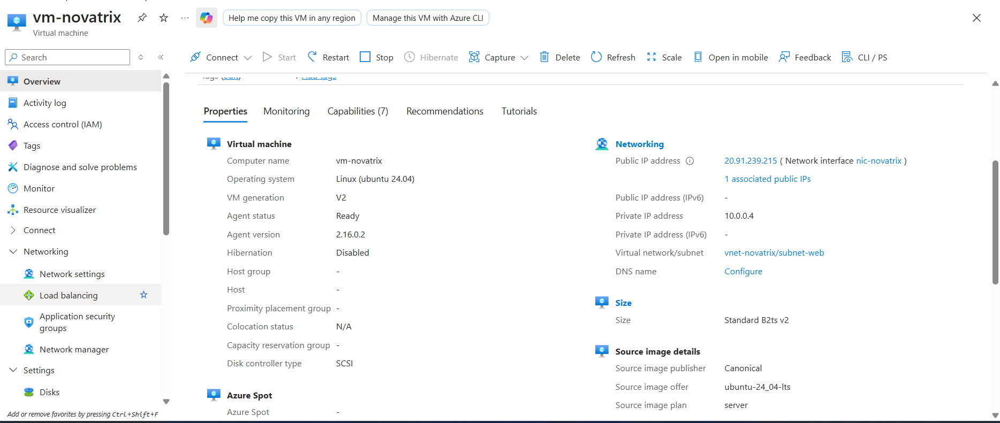
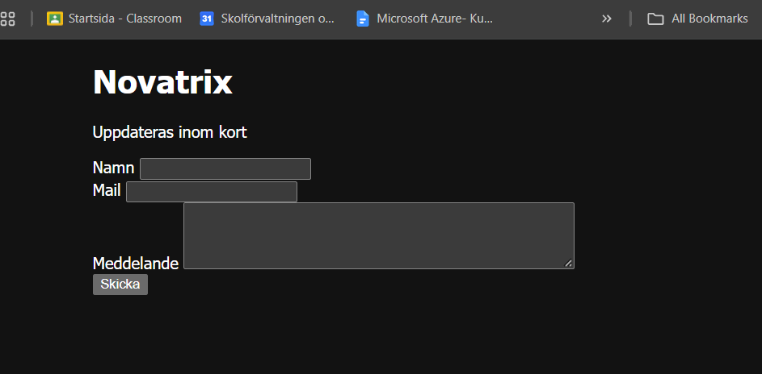

# Vecka 38 – Infrastructure as Code (CLI & ARM-template)

Tidigare veckor har miljön (VM, nätverk, NSG, storage m.m.) byggts upp grafiskt via Azure Portal. Den här veckan återskapas samma typ av miljö helt i kod via Azure CLI, ARM-templates och Bicep, så att den kan driftsättas reproducerbart utan manuella klick i portalen.

## Filerna

- `storage.bicep` – ett enda storage account skrivet i Bicep.
- `azuredeploy-enkel.json` – samma storage account i ARM JSON.
- `azuredeploy-parametriserad.json` + `azuredeploy.parameters.json` – samma resurs, men parametriserad med `location` och `sku`.
- `miljo-skelett.json` – skelettet där själva miljön byggs: NSG med webbregel (port 80/443), VNet med subnät och storage account, samt (för VG) en VM kopplad med `dependsOn`.

## Delmoment 1 – Repo

Templates ligger versionshanterade i det här repot, under `V38/`.

## Delmoment 2 – Skriv template(s)

`miljo-skelett.json` provisionerar de centrala delarna av Novatrix miljö helt i kod:

- **NSG** (`nsg-novatrix`) med webbregel (port 80 & 443)
- **VNet** (`vnet-novatrix`) med subnät `subnet-web`, kopplat till NSG:n
- **Storage account** (`Standard_LRS`, `StorageV2`)
- **Publik IP** (Standard, statisk) och **NIC**, kopplade till VNet-subnätet
- **VM** (Ubuntu Server 24.04, `Standard_B2ts_v2`), inloggning via SSH-nyckel (ingen lösenordsautentisering)

Resurserna är kedjade med `dependsOn`: NSG → VNet → NIC → VM. VM:en bootstrapas automatiskt vid uppstart via `customData` (cloud-init), som installerar Nginx och lägger ut samma ärendeformulär som i vecka 34, helt utan manuella SSH-steg.

## Delmoment 3 – Deploya från kod

Miljön deployades mot resursgruppen `rg-novatrix` (Sweden Central) med Azure CLI:

```bash
az group create -n rg-novatrix -l swedencentral

az deployment group what-if -g rg-novatrix --template-file miljo-skelett.json \
  --parameters sshPublicKey="<publik SSH-nyckel>"

az deployment group create -g rg-novatrix --template-file miljo-skelett.json \
  --parameters sshPublicKey="<publik SSH-nyckel>"
```

**Resultat:**

| Resurs | Namn/värde |
|---|---|
| VM | `vm-novatrix` |
| Publik IP | `20.91.239.215` |
| Storage account | `stnovatrixw7exi6thpfmeq` |

**Verifiering:**

- `az deployment group create` slutfördes utan fel (exit code 0). Portalen bekräftar samma sak under **Resursgrupp → Deployments**, med statusen "Succeeded":

  

- Deploymentens detaljvy visar samtliga 6 resurser skapade med status OK:

  

- VM:ens egenskaper i portalen matchar templaten: Ubuntu 24.04, storlek Standard B2ts v2, publik IP `20.91.239.215`, kopplad till `vnet-novatrix/subnet-web`:

  

- Formuläret är nåbart: `curl http://20.91.239.215/` returnerar HTTP 200 med Novatrix ärendeformulär (rubrik, fälten Namn/Mail/Meddelande) identiskt med sidan från vecka 34, men nu helt automatiskt utlagd via cloud-init i templaten istället för manuellt via `nano`. Bekräftat i webbläsaren:

  

- Lagringen är på plats: `az storage account show -g rg-novatrix -n stnovatrixw7exi6thpfmeq` visar `provisioningState: Succeeded`, `sku: Standard_LRS`, `kind: StorageV2`.

## Delmoment 4 – Visa versionshantering

Miljön byggdes upp i flera separata commits istället för en enda stor ändring:

```
b45299a Add formUrl output to V38 template for easier verification
54d07c6 Add VM, public IP and NIC to V38 environment for VG-level
d3e5be6 Add NSG, VNet/subnet and storage account to V38 environment skeleton
7dcc2a2 Add Week 38 section with IaC starter kit (ARM templates & Bicep)
```

Som ett konkret exempel på en ändring: efter att G- och VG-delarna var deployade och verifierade, lades en `formUrl`-output till i `miljo-skelett.json` (commit `b45299a`) för att slippa bygga ihop URL:en manuellt av `publicIpAddress`.

**Varför det hjälper drift och samarbete:**

- Varje ändring i infrastrukturen är spårbar, man ser exakt vad som lades till (NSG, VNet, VM …) och när, i stället för att behöva komma ihåg vad som klickades i portalen.
- Går det sönder går det att gå tillbaka till en tidigare, fungerande version av templaten med `git revert`/`git checkout`, istället för att felsöka en portal utan historik.
- Fler personer kan arbeta mot samma miljödefinition och se varandras ändringar som diffar i templaten, istället för att bara kunna fråga muntligt "vad ändrade du i portalen?".

## Delmoment 5 – Dokumentera

**Så återskapas miljön helt från repot, utan klick i portalen:**

```bash
git clone https://github.com/96lonsor/azure-MOV25.git
cd azure-MOV25/V38

az login
az group create -n rg-novatrix -l swedencentral

# Generera en SSH-nyckel att logga in med 
ssh-keygen -t ed25519 -f ~/.ssh/id_ed25519_novatrix -N ""

az deployment group create -g rg-novatrix --template-file miljo-skelett.json \
  --parameters sshPublicKey="$(cat ~/.ssh/id_ed25519_novatrix.pub)"
```

Deploymenten skapar NSG, VNet/subnät, storage account, publik IP, NIC och VM i ett enda kommando. VM:en installerar och konfigurerar sig själv vid uppstart via `customData`, så ingen manuell SSH-konfiguration krävs, hela kedjan från kod till fungerande kundtjänstformulär är reproducerbar.

**Deploya med egna parametrar**

`miljo-skelett.parameters.json` innehåller alla parametrar (`namePrefix`, `location`, `adminUsername`, `sshPublicKey`) och kan redigeras för att t.ex. döpa om resurserna, byta region eller admin-användarnamn. Fyll i din egen publika SSH-nyckel istället för platshållaren, och deploya sedan med:

```bash
az deployment group create -g rg-novatrix --template-file miljo-skelett.json \
  --parameters @miljo-skelett.parameters.json
```

**Nedrivning** (för att inte förbruka onödig kredit):

```bash
az group delete --name rg-novatrix --yes --no-wait
```
