# Vecka 39 – Power Automate och Microsoft 365

Novatrix ärendeformulär skickar redan idag in ärenden till Flask-backend på `vm-novatrix-web`, som sparar dem i Blob Storage (se [V37](../V37/README.md)). Den här veckan är målet att koppla på Microsoft 365 så att ett ärende även dyker upp i ett register i SharePoint och att kundtjänst får en notis om det, via ett Power Automate-flöde.

## Delmoment 1 – Repo

Skapat ett nytt avsnitt för v39 och uppdaterat `README.md` i roten.

## Delmoment 2 – Bygg ett flöde

Uppgift: skapa ett Power Automate-flöde som triggas när ett nytt ärende kommer in.

Ärenden sparas redan automatiskt som filer i Blob Storage-containern `arenden` när någon skickar in formuläret (se Delmoment 4). Därför byggdes flödet för att bevaka containern direkt, istället för att vänta på ett anrop utifrån.

- Skapade ett nytt automatiserat molnflöde i Power Automate.
- Trigger: **When a blob is added or modified (properties only) (V2)**, kopplad mot storage account `stnovatrixw7exi6thpfmeq` (Access Key-anslutning), och pekar på containern `arenden`.
- La till ett **Send an email (V2)**-steg direkt efter triggern, för att kunna testa hela kedjan innan resten av flödet (SharePoint-listan, den riktiga notisen) byggs ut.
- Testade genom att skicka in riktiga ärenden via formuläret — containern `arenden` har nu flera filer (bl.a. `arende-27727c98...`), och flödeskörningen visar grönt både på triggern och mejlsteget:

  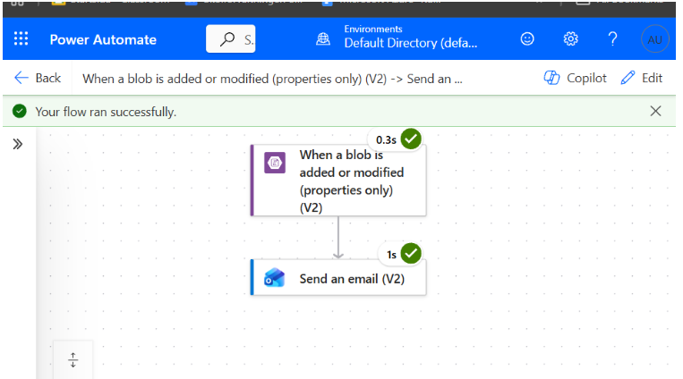
  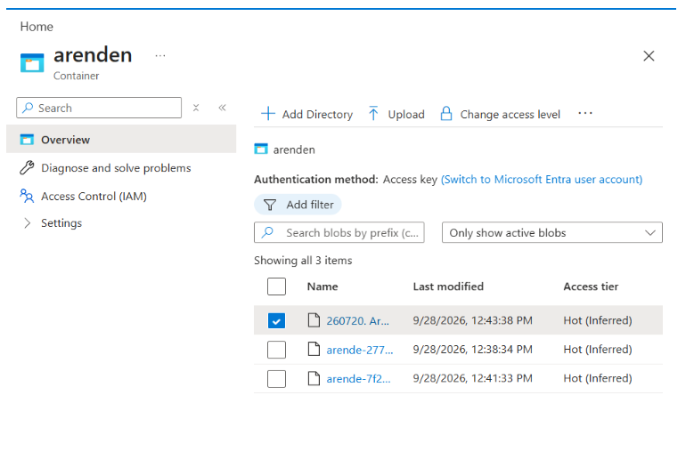

Det bekräftar Delmoment 2: ett riktigt inskickat ärende landar som en ny blob i `arenden`, vilket triggar Power Automate-flödet automatiskt utan att jag behöver göra något manuellt.

I Delmoment 3 bytte jag sedan till en HTTP-trigger istället (se nedan). Blob-flödet finns kvar men är avstängt, så att det inte skickas dubbla notiser.

## Delmoment 3 – Integrera mot Microsoft 365

Uppgift: låt flödet skapa en post i en SharePoint-lista som fungerar som Novatrix ärenderegister, och skicka en notis i Teams eller ett mejl i Outlook till kundtjänst.

Här ändrade jag upplägget från Delmoment 2. Blob-triggern fungerade, men den ger bara filens egenskaper (namn, storlek osv.), så flödet hade behövt två extra steg, **Get blob content** och **Parse JSON**, för att komma åt själva ärendet. Min lärare visade ett flöde med HTTP-trigger och det passade bättre här: backenden skickar ärendet direkt till flödet, så namn, mail och meddelande finns tillgängliga redan från första steget. Jag byggde därför ett nytt flöde, **Novatrix ärende till M365**.

Först skapade jag listan `Novatrix ärenderegister` på SharePoint-siten https://96lonsorgmail.sharepoint.com med kolumnerna Title (kundens namn), Ärende-ID, E-post, Meddelande, Inskickat (datum och tid) och Status (Ny / Pågående / Avslutad, där Ny är standard).

Flödet har tre steg som körs uppifrån och ner:

1. **When an HTTP request is received** – triggern. Den ger en adress som backenden anropar, och JSON-schemat matchar det appen skickar: `arendeId`, `namn`, `epost`, `meddelande` och `tidpunkt`.
2. **Create item** (SharePoint) – skapar en rad i `Novatrix ärenderegister`. Fälten från triggern mappas till listans kolumner och Status sätts till Ny.
3. **Send an email (V2)** (Outlook) – mejl till kundtjänst med ärende-ID i ämnesraden och namn, e-post och meddelande i texten.

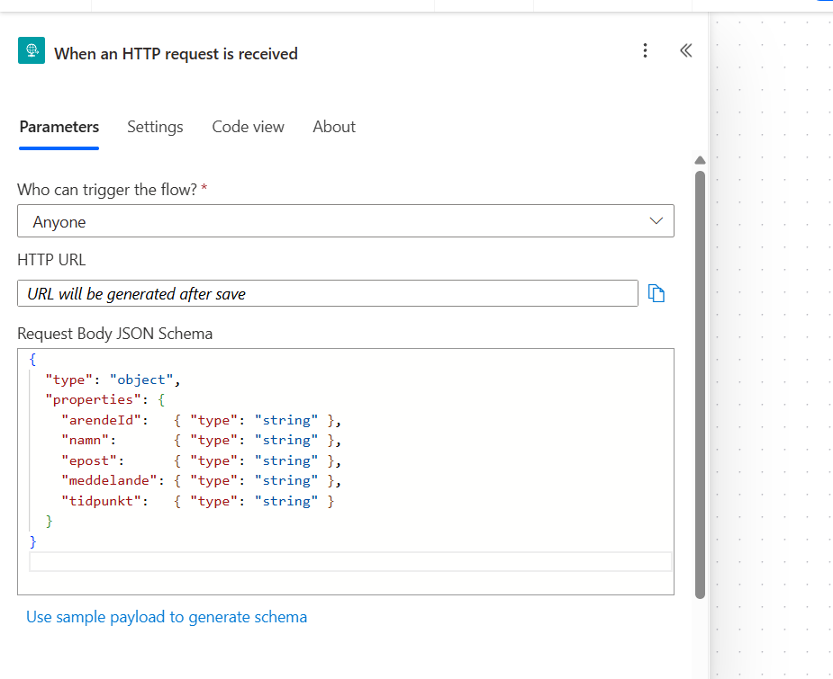
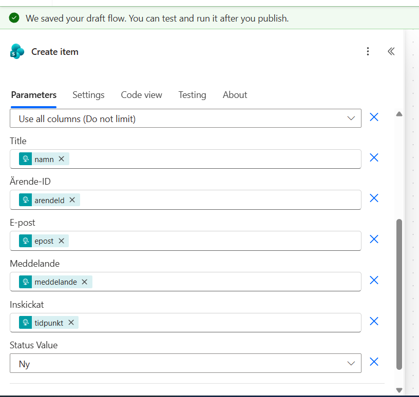

Test: jag skickade in ett ärende via formuläret och fick ärende-id `e78c4e9a`. Flödet körde grönt i alla tre steg, ärendet dök upp som en ny rad i listan med status Ny, och mejlet "Nytt ärende e78c4e9a" kom fram.

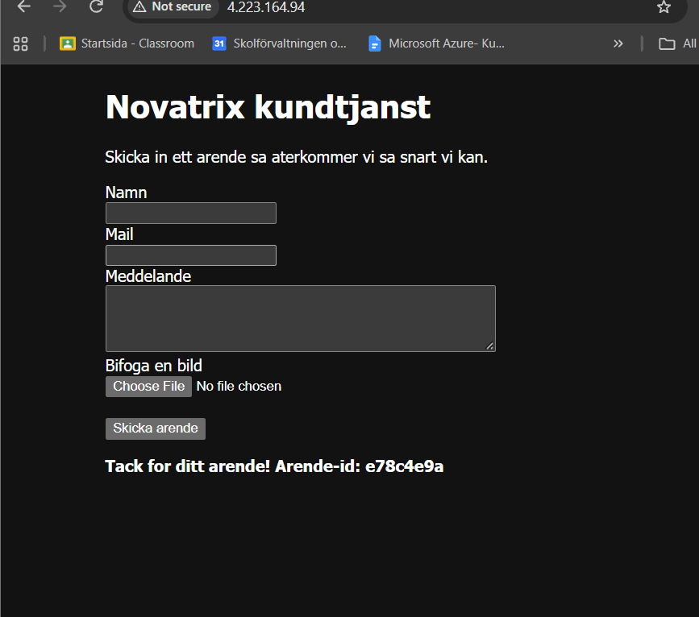
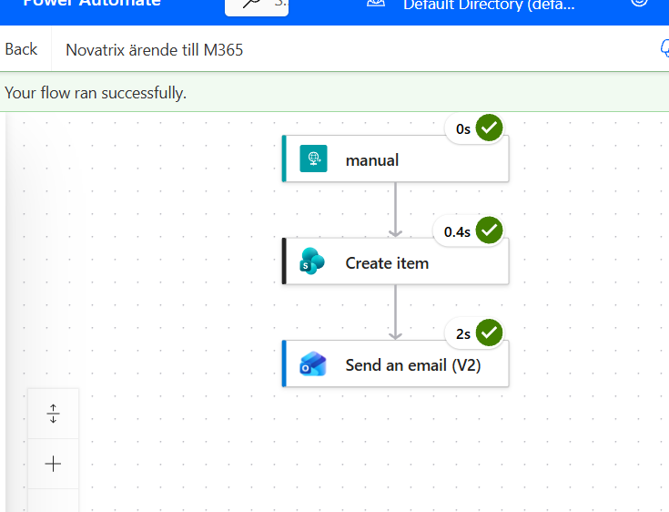
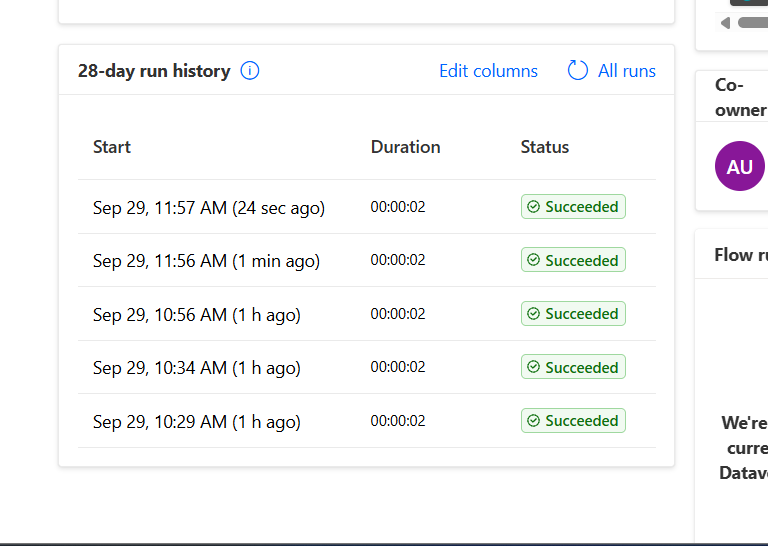
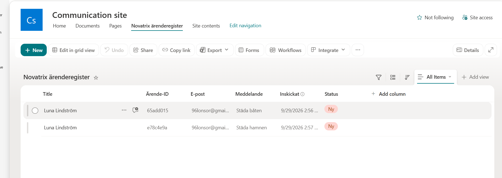
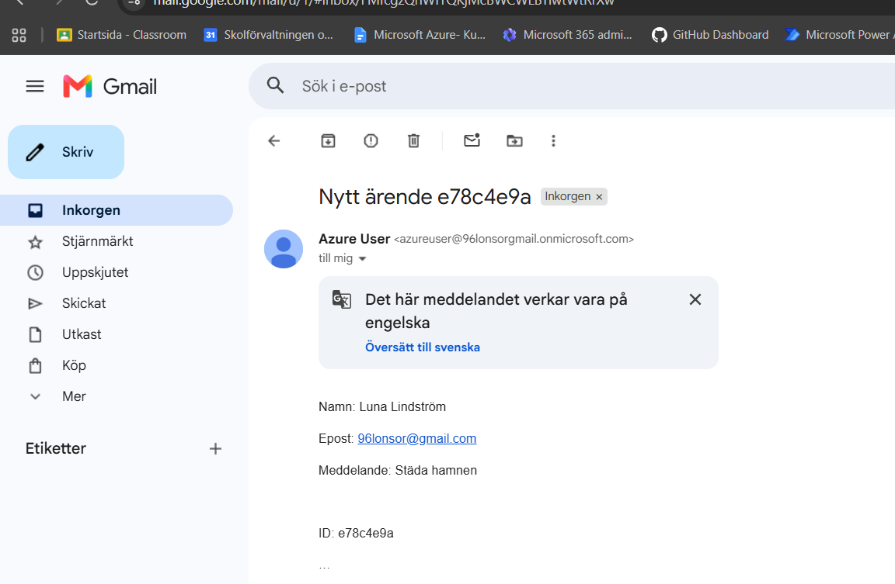

### Utbyggd händelsekedja: SharePoint, Teams och Outlook

Uppgift: bygg ut flödet till en händelsekedja som integrerar med flera tjänster, motivera designen och beskriv hur kedjan skulle kunna utökas.

Jag lade till en notis i Teams. Jag skapade teamet **Novatrix support** med kanalen **Ärenden**, och flödet postar dit med åtgärden **Post message in a chat or channel** (som Flow bot). Nu ser flödet ut så här:

```
HTTP-trigger (ärendet från formuläret)
        ↓
Create item (SharePoint)
        ↓
   ┌────┴─────────────┐
Send an email      Post message
(Outlook)          (Teams)
```

Varför just den här ordningen:

- **SharePoint först.** Registret är det viktigaste, det är där ärendet ska finnas kvar och följas upp. Om det steget misslyckas körs inte notiserna heller, så kundtjänst får aldrig en notis om ett ärende som inte finns i registret.
- **Teams och Outlook parallellt.** Notiserna har inget med varandra att göra, så de väntar bara på att Create item lyckats och inte på varandra. Om Teams skulle krångla kommer mejlet ändå fram, och tvärtom. Från början hamnade Teams-steget i rad före mejlet, så jag ändrade mejlets **Run after** till att bara vänta på Create item.
- **Två kanaler för olika behov.** Teams-kanalen är där kundtjänst ser nya ärenden direkt under dagen, och mejlet finns kvar i inkorgen som en logg och når även den som inte har Teams uppe.

Test: jag skickade in ärendet `ca6100be` via formuläret. I körningen syns grenarna bredvid varandra under Create item, och alla steg är gröna. Ärendet hamnade i listan med status Ny, meddelandet kom upp i Teams-kanalen Ärenden, och mejlet "Nytt ärende ca6100be" kom fram.

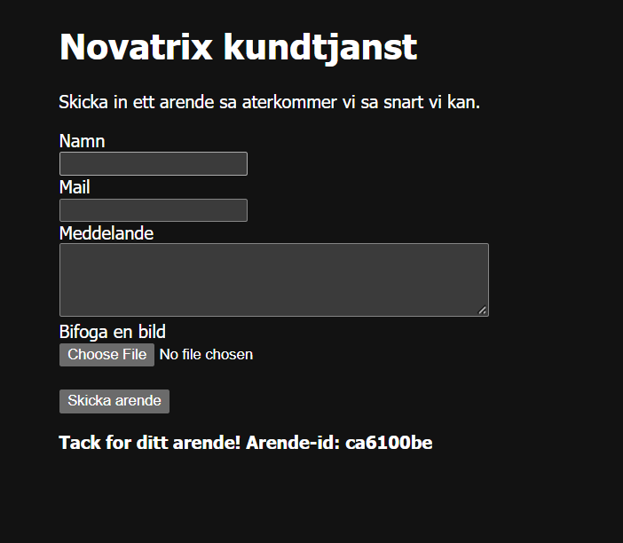
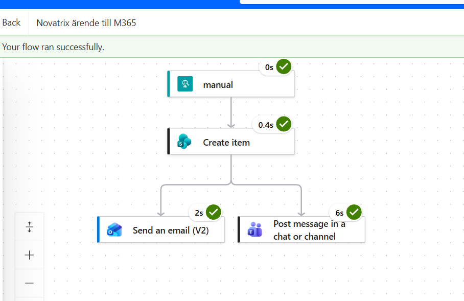
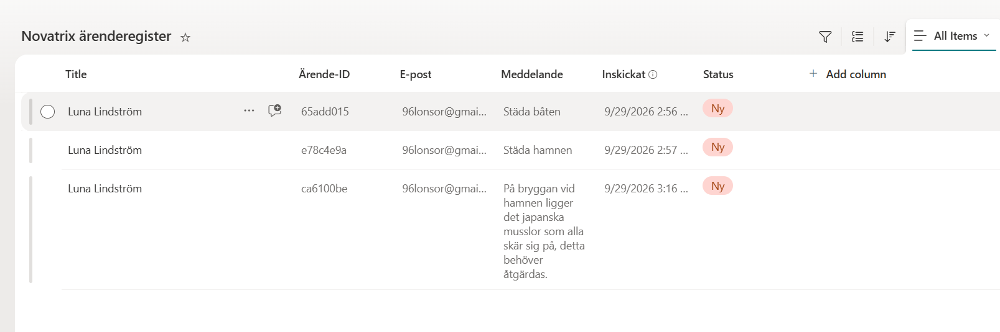
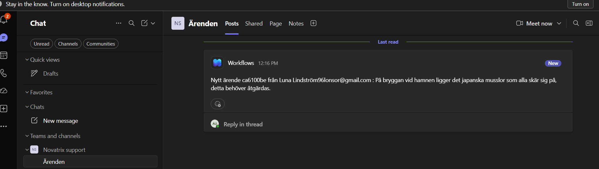
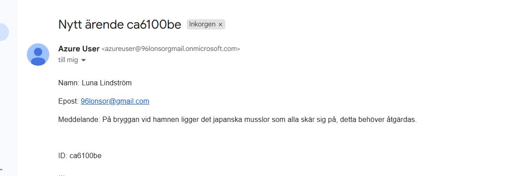

Hur kedjan skulle kunna utökas:

- **Länk till ärendet i notiserna.** Create item ger en *Link to item* som kan läggas in i både Teams-meddelandet och mejlet, så att man kommer direkt till rätt rad i registret.
- **Kvittens till kunden.** Ett till mejl, till adressen kunden skrev i formuläret, med ärende-id:t och ett "vi har tagit emot ditt ärende".
- **Prioritering med villkor.** Ett **Condition**-steg som kollar meddelandet efter ord som "akut" eller "fungerar inte" och då sätter en högre prioritet i listan eller taggar någon i Teams.
- **Bilagan.** Appen sparar redan bilden i Blob Storage. Filnamnet skulle kunna skickas med till flödet och sparas i listan, så att kundtjänst ser att det finns en bild.
- **Ett andra flöde när ärendet stängs.** Triggern **When an item is modified** på listan, som mejlar kunden när Status ändras till Avslutad.
- **Felhantering.** En gren som körs med Run after "has failed" och skickar en varning om till exempel SharePoint-steget inte går igenom.

## Delmoment 4 – Koppla ihop med Azure

Uppgift: knyt flödet till Azure-lösningen så att kedjan går hela vägen, från ett inskickat ärende i formuläret till en post i M365 och en notis till kundtjänst.

`vm-novatrix` kör en Flask-backend (`app.py`) som tar emot formuläret och sparar varje ärende som en JSON-fil i containern `arenden`, autentiserat med VM:ens system-assigned managed identity (rollen Storage Blob Data Contributor, scopead till containern) — ingen nyckel i koden.

Efter att ärendet sparats skickar appen samma JSON till flödets HTTP-adress. Om flödet inte svarar loggas det bara, ärendet finns ändå kvar i Blob Storage. Hela kedjan blir alltså:

formulär → Flask på VM:en → Blob Storage + anrop till flödet → rad i SharePoint → notis i Teams och mejl i Outlook

Flödets adress innehåller en nyckel (`sig=...`), så den ligger inte i repot. I [`V38/miljo-skelett.json`](../V38/miljo-skelett.json) är den en `securestring`-parameter, `flowUrl`, som skickas med vid deploy:

```
az deployment group create -g rg-novatrix --template-file V38/miljo-skelett.json --parameters V38/miljo-skelett.parameters.json flowUrl="<adressen från flödets trigger>"
```

Mallen skriver adressen till `/etc/arendeapp.env` på VM:en, en fil som bara root kan läsa, och tjänsten läser in den därifrån. Den körande VM:en har uppdaterats med samma `app.py` som mallen innehåller. Mallen i sig är validerad men inte deployad på nytt.

Min lärare tipsade också om en `/health`-endpoint för att snabbt se att backenden lever och är rätt konfigurerad. http://4.223.164.94/health svarar:

```json
{"account":"stnovatrixw7exi6thpfmeq","container":"arenden","flow_configured":true,"status":"ok"}
```

## Delmoment 5 – Verifiera och dokumentera

Uppgift: visa hela kedjan från inskickat ärende till utförd åtgärd i Microsoft 365, och dokumentera flödets steg.

Pågående. Flödet ligger i en lösning (`Novatrix ärendeflöde`) i Power Automate så att det går att exportera. Kvar är att exportera lösningen och lägga flödets definition som JSON i repot.
