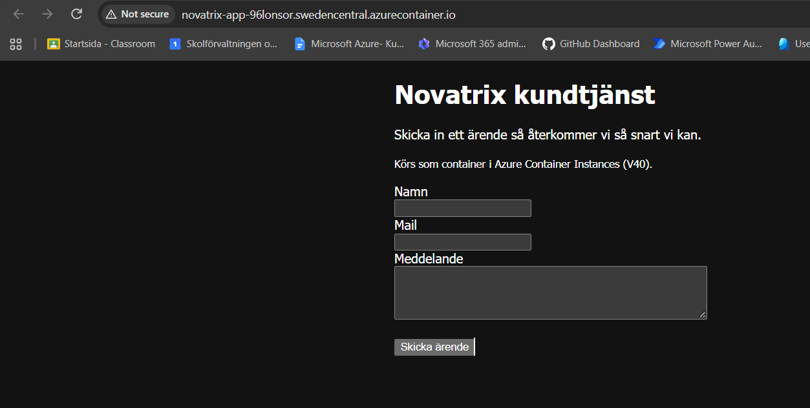

# Vecka 40 – Novatrix som container i ACI

Hittills har Novatrix-sidan legat på en VM. Först satte jag upp den för hand i portalen och sedan med ARM-template och cloud-init i V38. Den här veckan körs samma sida som en container i Azure Container Instances (ACI) i stället.

## Filerna

- `Dockerfile` – utgår från `nginx:alpine` och kopierar in `index.html`
- `index.html` – kundtjänstsidan, samma formulär som tidigare veckor

Jag valde `nginx:alpine` för att den är liten, bara några tiotal MB. Bygget och starten går snabbare, och det finns färre paket som kan ha säkerhetshål. Imagen innehåller bara nginx och sidan, inget mer.

En sak att veta är att det bara är en statisk sida. Flask-delen från V38/V39, den som sparade ärenden i blob storage och skickade dem till Power Automate, är inte med. Formuläret syns alltså, men det sparar inget. Uppgiften handlade om att flytta körningen från VM till container, så jag höll imagen så enkel som möjligt.

## Så gjorde jag

Jag körde allt med Azure CLI från `V40`-mappen. `novatrixacr` var redan taget (registry-namn måste vara unika i hela Azure), så mitt registry heter `novatrixacr96lonsor` och DNS-namnet blev `novatrix-app-96lonsor`.

```bash
az group create --name rg-novatrix --location swedencentral

az provider register --namespace Microsoft.ContainerInstance
az provider register --namespace Microsoft.Web
az provider register --namespace Microsoft.Storage
az provider register --namespace microsoft.insights
az provider register --namespace Microsoft.ContainerRegistry

az acr create --resource-group rg-novatrix --name novatrixacr96lonsor --sku Basic
az acr build --registry novatrixacr96lonsor --image novatrix-app:v1 .

az acr update --name novatrixacr96lonsor --admin-enabled true
az acr credential show --name novatrixacr96lonsor

az container create --resource-group rg-novatrix --name novatrix-app \
  --image novatrixacr96lonsor.azurecr.io/novatrix-app:v1 \
  --os-type Linux --cpu 1 --memory 1 --ports 80 \
  --dns-name-label novatrix-app-96lonsor \
  --registry-login-server novatrixacr96lonsor.azurecr.io \
  --registry-username novatrixacr96lonsor \
  --registry-password "<ett av lösenorden>"
```

Det smidiga med `az acr build` är att imagen byggs direkt i Azure, så jag behövde inte ha Docker installerat. Det tog runt 30 sekunder.

Det som strulade var `az container create`. Två gånger fick jag `InaccessibleImage` ("Please check the image and registry credential"), fast imagen låg i registryt och lösenordet stämde. Jag testade att logga in mot registryt direkt och det fungerade, så felet var inte lösenordet. Till slut såg jag att `Microsoft.ContainerInstance` fortfarande stod på "Registering". När registreringen blev klar körde jag samma kommando igen och då gick det igenom.

## Verifiering

```bash
az container show --resource-group rg-novatrix --name novatrix-app --query ipAddress.fqdn -o tsv
# novatrix-app-96lonsor.swedencentral.azurecontainer.io
```

Containern fick status `Succeeded` och IP `74.158.14.106`. Adressen svarade med HTTP 200 från nginx och rubriken "Novatrix kundtjänst", och i `az container logs` syns anropet. Så här ser det ut i webbläsaren:



## VM, container och serverless

Det är tre nivåer där man lämnar över mer och mer till Azure.

Med en **VM** hyr man en hel virtuell dator. Man väljer operativsystem och installerar det man vill, men man får också sköta allt själv: uppdateringar, säkerhet, nätverk och att maskinen är igång. Den kostar så länge den är på, oavsett om någon använder den.

En **container** packar appen tillsammans med det den behöver (i mitt fall nginx och en HTML-sida) i en image. Azure sköter maskinen och operativsystemet under, och jag bestämmer bara vad som ska ligga i containern. Den startar på sekunder och betalas per sekund den kör.

Med **serverless** (Azure Functions) skriver man bara koden. Den körs när något händer, till exempel ett HTTP-anrop, och Azure sköter resten, även skalningen. När inget händer körs inget och då kostar det i princip inget heller. Däremot passar det bäst för korta, avgränsade uppgifter och mindre bra för något som ska vara igång hela tiden.

| | Kontroll | Drift | Kostnad | Skalbarhet |
|---|---|---|---|---|
| **VM** | Mest. Jag väljer OS, programvara och nätverk. | Mest jobb. Jag sköter uppdateringar, säkerhet, SSH och att den är igång. | Betalar dygnet runt så länge den är på, även när ingen använder den. | Manuell. Större VM eller fler VM:ar med lastbalanserare, och det tar minuter. |
| **Container** | Mellan. Jag bestämmer vad som ligger i imagen men inte maskinen under. | Lite. Inget OS att patcha, bara imagen att hålla uppdaterad. | Per sekund för CPU och minne medan den kör. Registryt kostar lite för lagring. | ACI skalar inte själv. Container Apps kan skala ut och ner till noll. |
| **Serverless** | Minst. Jag styr bara koden och triggern. | Nästan inget. Azure sköter allt under koden. | Per körning, och med få anrop som Novatrix hamnar man nära noll. | Automatisk. Azure startar fler instanser när det behövs. |

## Varför container i stället för VM?

Med VM:en fick jag sköta ett helt operativsystem bara för att visa en webbsida. Det var uppdateringar, nginx-konfiguration, SSH-nycklar, NSG, VNet, NIC och publik IP. Med cloud-init i V38 gick det att automatisera, men det tog ändå några minuter innan sidan var uppe, och om skriptet gick fel märkte jag det först när sidan inte svarade. Jag stötte dessutom på kvotproblem med VM-storlekarna i swedencentral.

Containern innehåller bara nginx och sidan. Den byggs en gång och fungerar likadant var den än körs. ACI sköter maskinen under den, så det finns inget OS att patcha. Den här gången var sidan uppe på någon minut, och resursgruppen har två resurser i stället för sex–sju.

Det finns också saker som inte är så bra med ACI, och därför skulle jag inte köra en riktig produktionstjänst så här:

- ACI har ingen lastbalansering eller autoskalning, så vid mycket trafik är Container Apps eller App Service ett bättre val (samma image fungerar där)
- IP-adressen kan bytas om containern skapas om, så man ska använda DNS-namnet
- admin-kontot på registryt är en genväg. Bättre vore en managed identity med bara AcrPull, ungefär som VM:en använde managed identity mot storage i V39
- det är bara HTTP, inget certifikat

## Vilken nivå passar Novatrix?

### Motivering

Novatrix är ett litet företag. Det kommer några ärenden i timmen på dagen och nästan inga på natten. Att ha en VM igång dygnet runt för det känns som att betala för mycket. Jag skulle hellre dela upp lösningen.

Webbsidan passar bra som container, eftersom den är statisk och inte sparar något själv. Den kan startas om eller flyttas utan att något går förlorat, och om det behövs mer kapacitet kan samma image köras i Container Apps, som kan skala upp och ner till noll automatiskt.

Ärendemottagningen, alltså det som Flask-appen gjorde i V39, skulle passa som en Azure Function med HTTP-trigger. Den gör bara en sak per ärende: tar emot, sparar och skickar vidare. Med Consumption-planen betalar man per körning, och med så få ärenden som Novatrix får hamnar man i stort sett inom gratisnivån. Det här är ett förslag på hur jag skulle lägga upp det. Att bygga det ingick inte i den här uppgiften.

Ärendena ska ligga kvar i Blob Storage som i V37–V39. Containrar ska kunna slängas och skapas om, men ärenden får inte försvinna, så de ska inte ligga i containern. Lagring är dessutom billigt för lite JSON och några bilder.

Då blir VM:en överflödig och kan stängas av. Behövs den igen finns den som kod i V38.

Sammanfattningsvis tar Azure över mer av driften, Novatrix betalar för det som faktiskt används och varje del kan skalas för sig.

### Optimering

Containern fick 1 vCPU och 1 GB minne. Det räcker gott för nginx med en enda sida, och eftersom ACI tar betalt per sekund för CPU och minne finns det ingen anledning att ge den mer. Förmodligen skulle 0.5 GB också räcka.

När jag är klar med testerna river jag hela resursgruppen (se längst ner), precis som jag gjorde efter V39, så att inget står och drar kredit i onödan. Om jag bara vill pausa kan jag köra `az container stop`, och då kostar den ingen beräkningskraft. Registryt ligger på Basic, som är den billigaste nivån och räcker gott för en image.

### IaC

Allt som behövs för att bygga upp det här igen finns i repot: Dockerfile, sidan och kommandona ovan. Det finns inget som jag har klickat fram i portalen och måste komma ihåg. Det enda som saknas är registry-lösenordet, och det är medvetet. Det hämtas med `az acr credential show` när containern skapas.

```bash
git clone https://github.com/96lonsor/azure-MOV25.git
cd azure-MOV25/V40
# och sen kommandona under "Så gjorde jag"
```

Imagen är taggad `novatrix-app:v1` och inte `latest`, och `v1` är den enda taggen i registryt. Då vet jag exakt vilken version som körs. Nästa ändring blir `v2`, och går något fel är det bara att peka tillbaka på `v1`. Namnen säger också vad sakerna är, så `novatrix-app` i `rg-novatrix` är lätt att hitta senare, till skillnad från något i stil med `app:latest`.

Jämfört med V38 är det här mycket enklare att återskapa. Där behövdes en ARM-template med sex resurser och ett cloud-init-skript, och här räcker en Dockerfile på några rader och en handfull kommandon. Om jag skulle bygga vidare skulle jag lägga registry och container i en Bicep-fil, så att det blir deklarativt även det.

## Nedrivning

```bash
az group delete --name rg-novatrix --yes --no-wait
```
